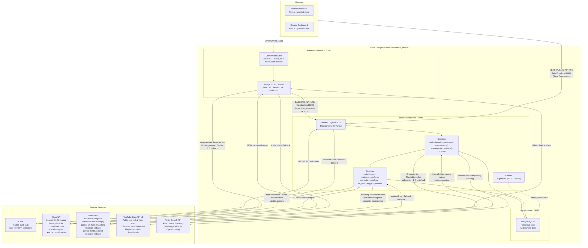
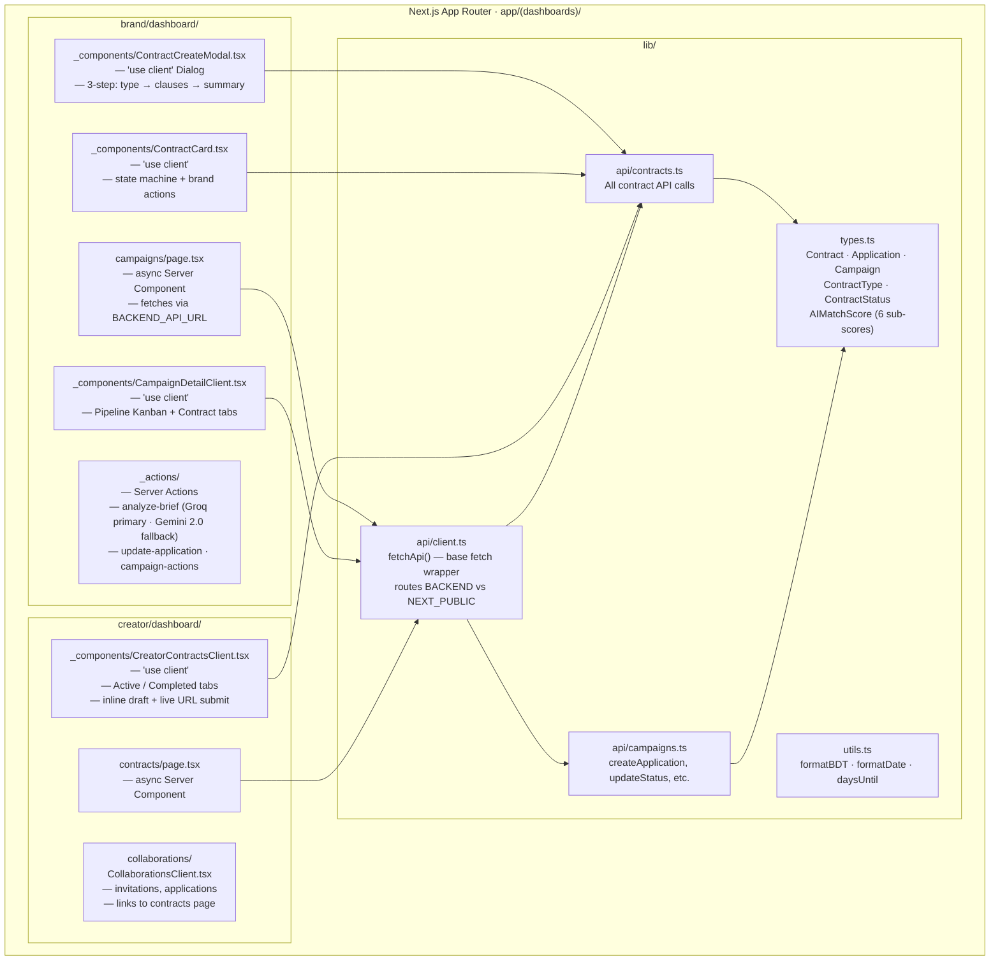
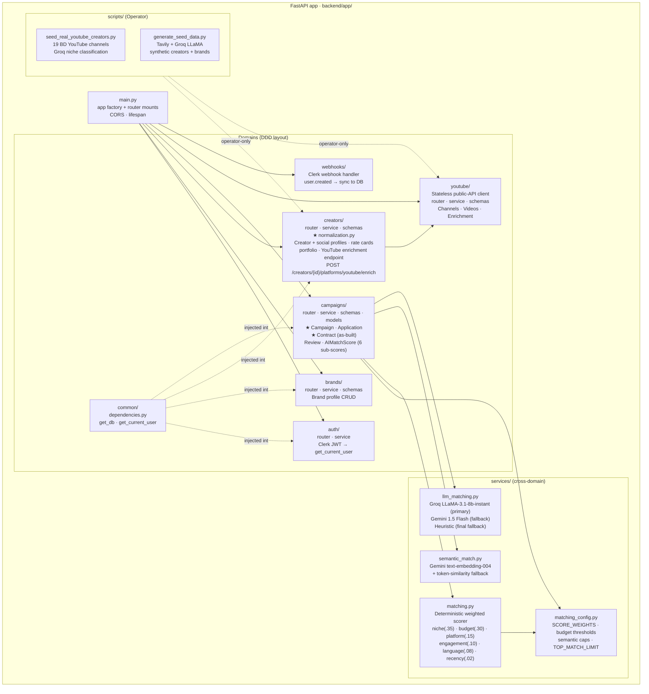

# Architecture Diagram

> **As-built system architecture** — reflects what is actually running in Docker Compose.
> Focuses on *how the system is deployed and structured* — not what data flows where (see `dfd.md`).
>
> Two views are provided:
> 1. **Runtime topology** — containers, ports, network, and external services
> 2. **Internal structure** — Next.js rendering model and FastAPI domain layout

---

## 1. Runtime Topology



---

## 2. Internal Structure

### 2a. Next.js — Server / Client Island Pattern



### 2b. FastAPI — Domain Structure



---

## 3. Request Paths

### Brand: "Run Matching"
```
Browser → Next.js (Client) → POST http://localhost:8000/campaigns/{id}/run-matching
→ FastAPI → campaigns/router → campaigns/service.run_campaign_matching
→ services/matching_config.py (SCORE_WEIGHTS · thresholds)
→ services/matching.py (6-signal deterministic scorer)
→ services/semantic_match.py (Gemini text-embedding-004 — semantic rescue if niche=0)
→ services/llm_matching.py
    → Groq LLaMA-3.1-8b-instant (primary — match rationale top-N)
    → Gemini 1.5 Flash (fallback)
    → Heuristic (final fallback)
→ ai_match_scores (INSERT / UPDATE — all 6 sub-scores + score_semantic) → PostgreSQL
→ JSON response → CampaignDetailClient (Matches tab — 6-bar breakdown)
```

### Brand: "Analyze Campaign Brief"
```
Browser → Campaign Wizard → Server Action: analyzeBriefAction (analyze-brief.ts)
→ Groq LLaMA-3.1-8b-instant (primary — structured JSON: visibility, niche, budget, hashtags, KPIs)
→ Gemini 2.0 Flash (fallback if Groq unavailable)
→ pre-fills wizard fields; brand edits before submit
```

### Creator: "YouTube Channel Enrichment"
```
Backend or Operator → POST /creators/{id}/platforms/youtube/enrich
→ FastAPI → creators/router → creators/service
→ app/youtube/service.get_channel_enrichment (Channels.list + PlaylistItems.list + Videos.list · ~3 units)
→ creators/normalization.py
    → YOUTUBE_CATEGORY_MAP (deterministic niche from topic URLs)
    → Groq LLaMA-3.1-8b-instant (optional — niche from channel/video descriptions)
    → Bangla/English/Banglish heuristic (language detection)
    → city normalization
→ creator_social_profiles (UPSERT — is_api_verified=true, data_source="verified") → PostgreSQL
→ creator_portfolio_items (UPSERT by content_url — recent video imports) → PostgreSQL
```

### Brand: "Accept Creator → Create Contract"
```
Browser → ApplicationDrawer "Accept & Set Contract Terms" button
→ Server Action: updateApplicationStatus(accepted)
→ PATCH http://localhost:8000/campaigns/{id}/applications/{appId} → PostgreSQL
→ ContractCreateModal opens (client-side)
→ Step 1: choose type → Step 2: clauses → Step 3: review fee breakdown
→ POST http://localhost:8000/campaigns/{id}/applications/{appId}/contract
→ FastAPI: campaigns/service.create_contract
→ platform_fee_percentage locked from CONTRACT_FEE_MAP
→ contracts INSERT → PostgreSQL
→ Modal closes → CampaignDetailClient switches to "Contracts" tab
```

### Creator: "Submit Draft Content"
```
Browser → CreatorContractsClient draft URL input + submit
→ PATCH http://localhost:8000/contracts/{id}/submit-draft
→ FastAPI: campaigns/service.submit_content_draft
→ validates status == active | in_production, validates creator ownership
→ contracts UPDATE (draft_content_url, status → content_submitted, submitted_at)
→ PostgreSQL → response → UI updates status chip + next-action callout
```

---

## 4. Environment Variables

| Variable | Consumed by | Value in Docker |
|---|---|---|
| `BACKEND_API_URL` | Server Components, Server Actions | `http://backend:8000` |
| `NEXT_PUBLIC_API_URL` | Browser / Client Components | `http://localhost:8000` |
| `CLERK_SECRET_KEY` | FastAPI JWT validation | Clerk dashboard |
| `NEXT_PUBLIC_CLERK_PUBLISHABLE_KEY` | Clerk frontend SDK | Clerk dashboard |
| `GROQ_API_KEY` | `llm_matching.py` (primary), `normalization.py` (niche), `analyze-brief.ts` (primary), `generate_seed_data.py` | Groq console |
| `GEMINI_API_KEY` | `semantic_match.py` (embeddings), `llm_matching.py` (fallback), `analyze-brief.ts` (fallback) | Google AI Studio |
| `YOUTUBE_API_KEY` | `app/youtube/service.py` — all YouTube API calls | Google Cloud Console |
| `TAVILY_API_KEY` | `scripts/generate_seed_data.py` — real creator discovery (seeding only) | Tavily dashboard |
| `DATABASE_URL` | SQLAlchemy engine (backend) | `postgresql+asyncpg://…@db:5432/cohesiq` |

> **Critical rules:**
> - Never use `BACKEND_API_URL` in a Client Component — it is not exposed to the browser.
> - Never use `NEXT_PUBLIC_API_URL` in a Server Component — it routes to localhost which is not reachable inside the Docker network.
> - Never expose `YOUTUBE_API_KEY` through any `NEXT_PUBLIC_` variable — it is server-side only.
> - `GROQ_API_KEY` is server-side only. `GEMINI_API_KEY` is server-side only.
