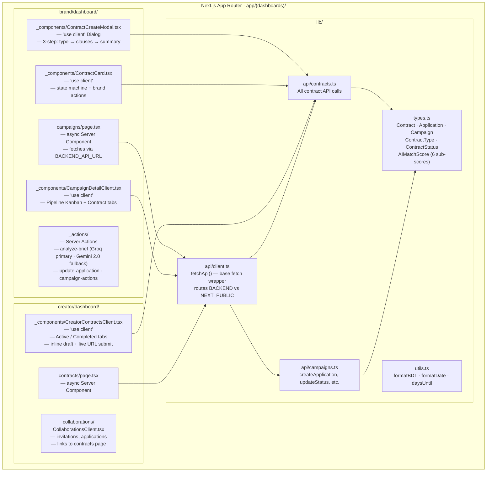

# Architecture Diagram

> **As-built system architecture** — reflects what is actually running in Docker Compose.
> Focuses on *how the system is deployed and structured* — not what data flows where (see `dfd.md`).
>
> Two views are provided:
> 1. **Runtime topology** — containers, ports, network, and external services
> 2. **Internal structure** — Next.js rendering model and FastAPI domain layout
>
> **Validated against** (2026-06-10): `docker-compose.yml`, `backend/app/main.py`,
> `backend/app/campaigns/router.py`, `backend/app/admin/router.py`,
> `backend/app/services/matching_config.py`,
> `frontend/cohesiq-v0/app/api/transcribe/route.ts`,
> `frontend/cohesiq-v0/app/api/campaign-suggestion/route.ts`,
> `frontend/cohesiq-v0/app/(dashboards)/brand/dashboard/campaigns/new/_components/StepIntro.tsx`,
> `frontend/cohesiq-v0/components/negotiation/NegotiationDrawer.tsx`,
> `frontend/cohesiq-v0/app/(dashboards)/brand/dashboard/campaigns/new/_actions/analyze-brief.ts`,
> Alembic versions (head `0022`).
>
> **Changelog (corrections applied 2026-06-10):**
> - DB container relabelled `db` → `postgres` (its actual compose service name); added the
>   `ngrok` tunnel container (profile `tunnel`).
> - Alembic range `0001 → 0017` → `0001 → 0022`.
> - Matching weights corrected to niche `.45` · budget `.20` · platform `.15` · engagement `.10`
>   · language `.08` · recency `.02` (matched `matching_config.py`).
> - Added the Groq **Whisper large-v3-turbo** STT path (`/api/transcribe`) and the
>   **client-side PDF parse** (pdfjs-dist in the browser, not the backend) for campaign creation.
> - Added the **offer / multi-turn negotiation** path with **4 s client polling**
>   (`NegotiationDrawer.tsx`).
> - Added the **AI brief analysis** routes: `/api/campaign-suggestion` (Groq `llama-3.3-70b-versatile`)
>   and `analyze-brief` Server Action (Groq `llama-3.1-8b-instant` primary · Gemini 2.0 Flash fallback).
> - Added the **admin** domain (`backend/app/admin/`) and the `(admin)` route group.
> - Tavily/synthetic-seed scripts demoted to a historical note — superseded by `seed.sql`; not a
>   live runtime dependency.

---

## 1. Runtime Topology

```mermaid
flowchart TB
    subgraph Browser[Browser]
        BrandUI[Brand Dashboard\nNext.js hydrated client]
        CreatorUI[Creator Dashboard\nNext.js hydrated client]
    end

    subgraph Docker["Docker Compose Network (cohesiq_default)"]
        subgraph FE["frontend container · :3000"]
            NextJS["Next.js 16 App Router\nReact 19 · Tailwind v4 · shadcn/ui"]
            ClerkMW["Clerk Middleware\nproxy.ts — auth gate +\nrole-based redirect"]
            NextAPI["Next.js Route Handlers (app/api/)\n/api/transcribe (Groq Whisper STT)\n/api/campaign-suggestion (Groq LLM)\n/api/image-proxy · /api/auth/{youtube,tiktok}"]
        end

        subgraph BE["backend container · :8000"]
            FastAPI["FastAPI · Python 3.12\nSQLAlchemy 2.0 Async · Pydantic v2"]
            Domains["Domains\nauth · brands · creators (+ normalization)\ncampaigns (+ contracts · offers · negotiation)\nadmin · webhooks · youtube · common"]
            Services["Services\nmatching.py · matching_config.py\nsemantic_match.py · llm_matching.py"]
            Alembic["Alembic\nmigrations (0001 → 0022)"]
        end

        subgraph PGC["postgres container · :5432"]
            PG["PostgreSQL 16\nRelational store (only)\nAll business data"]
        end

        subgraph NG["ngrok container · :4040\n(profile: tunnel)"]
            Ngrok["ngrok tunnel\npublic HTTPS → frontend:3000"]
        end
    end

    subgraph External[External Services]
        ClerkSvc["Clerk\nRS256 JWT auth\nuser identity + webhooks"]
        GroqAPI["Groq API\nllama-3.1-8b-instant (match rationale · brief primary · niche)\nllama-3.3-70b-versatile (campaign-suggestion)\nwhisper-large-v3-turbo (voice → text STT)"]
        GeminiAPI["Gemini API\ntext-embedding-004 (semantic embeddings — NOT persisted)\ngemini-1.5-flash (matching rationale fallback)\ngemini-2.0-flash (brief analyzer fallback)"]
        YTAPI["YouTube Data API v3\nPublic channel & video stats\nChannels.list · Videos.list\nPlaylistItems.list · TopicDetails"]
    end

    Browser -->|HTTP/HTTPS :3000| ClerkMW
    ClerkMW --> NextJS
    NextJS --> NextAPI
    Ngrok -.public tunnel.-> NextJS
    NextJS -->|BACKEND_API_URL\nhttp://backend:8000\nServer Components & Actions| FastAPI
    Browser -->|NEXT_PUBLIC_API_URL\nhttp://localhost:8000\nClient Components| FastAPI
    Browser -.PDF parsed in-browser (pdfjs-dist).-> NextJS
    Browser -.negotiation polling every 4 s.-> FastAPI
    FastAPI --> Domains --> Services
    Services --> PG
    Domains --> PG
    Alembic -.manages schema.-> PG

    FastAPI <-->|RS256 JWT validation| ClerkSvc
    ClerkSvc -->|webhook: user.created / deleted| FastAPI
    NextJS -->|analyze-brief Server Action\nLLaMA-3.1 primary · Gemini 2.0 fallback| GroqAPI
    NextJS -->|analyze-brief fallback| GeminiAPI
    NextAPI -->|/api/transcribe (Whisper) · /api/campaign-suggestion (LLaMA-3.3)| GroqAPI
    Services -->|match rationale · niche classification\nLLaMA primary| GroqAPI
    Services -->|matching rationale fallback\ntext-embedding-004 semantic embeddings| GeminiAPI
    GroqAPI -->|JSON · transcript| Services
    GroqAPI -->|JSON · transcript| NextAPI
    GeminiAPI -->|embeddings · fallback rationale| Services
    GeminiAPI -->|fallback brief analysis| NextJS
    Domains -->|Channels.list · PlaylistItems.list\nVideos.list · 1–3 units/call| YTAPI
    YTAPI -->|channel stats · recent videos\ntopic categories| Domains
```

> **Seeding note:** demo data is loaded from `db/seed.sql` (real YouTube/Instagram/TikTok data).
> The legacy Tavily + Groq synthetic-seed scripts are deprecated and are **not** a live runtime
> dependency — they are intentionally omitted from this topology.

---

## 2. Internal Structure

### 2a. Next.js — Server / Client Island Pattern



### 2b. FastAPI — Domain Structure

```mermaid
flowchart TB
    subgraph FastAPIApp["FastAPI app · backend/app/"]
        MainPY["main.py\napp factory + router mounts\nCORS · lifespan"]

        subgraph Domains["Domains (DDD layout)"]
            Auth["auth/\nrouter · service\nClerk JWT → get_current_user"]
            Brands["brands/\nrouter · service · schemas\nBrand profile CRUD"]
            Creators["creators/\nrouter · service · schemas\n★ normalization.py\nCreator + social profiles · rate cards\nportfolio · YouTube enrichment endpoint\nPOST /creators/{id}/platforms/youtube/enrich"]
            Campaigns["campaigns/\nrouter · service · schemas · models\n★ Campaign · Application\n★ Contract + ContractDeliverable\n★ Offer / NegotiationTurn flow\nReview · AIMatchScore (6 sub-scores)\nLiveContentMetricSnapshot"]
            Admin["admin/\nrouter · service · schemas\nrequire_admin guard\nstats · users · campaigns · reviews"]
            YouTubeDomain["youtube/\nStateless public-API client\nrouter · service · schemas\nChannels · Videos · Enrichment"]
            Common["common/\ndependencies.py\nget_db · get_current_user · require_admin"]
            Webhooks["webhooks/\nClerk webhook handler\nuser.created → sync to DB"]
        end

        subgraph ServiceLayer["services/ (cross-domain)"]
            MatchConfig["matching_config.py\nSCORE_WEIGHTS · budget thresholds\nsemantic caps · TOP_MATCH_LIMIT"]
            Matching["matching.py\nDeterministic weighted scorer\nniche(.45) · budget(.20) · platform(.15)\nengagement(.10) · language(.08) · recency(.02)"]
            Semantic["semantic_match.py\nGemini text-embedding-004\n+ token-similarity fallback"]
            LLMMatch["llm_matching.py\nGroq LLaMA-3.1-8b-instant (primary)\nGemini 1.5 Flash (fallback)\nHeuristic (final fallback)"]
        end

        subgraph Scripts["scripts/ (Operator)"]
            SeedSQL["db/seed.sql\nReal YouTube/Instagram/TikTok data\n(primary seeding path)"]
            ResetDB["reset_db.py · sync_clerk_users.py\nschema-agnostic wipe · Clerk role sync"]
        end

        MainPY --> Auth & Brands & Creators & Campaigns & Admin & YouTubeDomain & Webhooks
        Campaigns --> MatchConfig & Matching & Semantic & LLMMatch
        Matching --> MatchConfig
        Creators --> YouTubeDomain
        Common -.injected into.-> Auth & Brands & Creators & Campaigns & Admin
        Scripts -.operator-only.-> PG2[(PostgreSQL)]
    end
```



---

## 3. Request Paths

### Brand: "Run Matching"
```
Browser → Next.js (Client) → POST http://localhost:8000/campaigns/{id}/run-matching
→ FastAPI → campaigns/router → campaigns/service.run_campaign_matching
→ services/matching_config.py (SCORE_WEIGHTS · thresholds)
→ services/matching.py (6-signal deterministic scorer)
→ services/semantic_match.py (Gemini text-embedding-004 — semantic rescue if niche=0)
→ services/llm_matching.py
    → Groq LLaMA-3.1-8b-instant (primary — match rationale top-N)
    → Gemini 1.5 Flash (fallback)
    → Heuristic (final fallback)
→ ai_match_scores (INSERT / UPDATE — all 6 sub-scores + score_semantic) → PostgreSQL
→ JSON response → CampaignDetailClient (Matches tab — 6-bar breakdown)
```

### Brand: "Analyze Campaign Brief"
```
Browser → Campaign Wizard → Server Action: analyzeBriefAction (analyze-brief.ts)
→ Groq LLaMA-3.1-8b-instant (primary — structured JSON: visibility, niche, budget, hashtags, KPIs)
→ Gemini 2.0 Flash (fallback if Groq unavailable)
→ pre-fills wizard fields; brand edits before submit
```

### Creator: "YouTube Channel Enrichment"
```
Backend or Operator → POST /creators/{id}/platforms/youtube/enrich
→ FastAPI → creators/router → creators/service
→ app/youtube/service.get_channel_enrichment (Channels.list + PlaylistItems.list + Videos.list · ~3 units)
→ creators/normalization.py
    → YOUTUBE_CATEGORY_MAP (deterministic niche from topic URLs)
    → Groq LLaMA-3.1-8b-instant (optional — niche from channel/video descriptions)
    → Bangla/English/Banglish heuristic (language detection)
    → city normalization
→ creator_social_profiles (UPSERT — is_api_verified=true, data_source="verified") → PostgreSQL
→ creator_portfolio_items (UPSERT by content_url — recent video imports) → PostgreSQL
```

### Brand: "Send Offer → Negotiate → Accept" (offer-driven lifecycle, migration 0022)
```
Browser → OfferModal "Send Offer" (choose type · clauses · deliverable subset · rate)
→ POST http://localhost:8000/campaigns/{id}/applications/{appId}/offer
→ FastAPI: campaigns/service.send_offer
→ contracts INSERT (status='drafted', platform_fee_percentage locked from CONTRACT_FEE_MAP)
→ contract_deliverables INSERT (per-creator subset) · negotiation_turns INSERT (brand's opening turn)
→ application.status → 'invited'/'pending_agreement' → PostgreSQL

  ↳ either party counters:
    POST .../applications/{appId}/negotiate → service.counter_offer → negotiation_turns INSERT
    NegotiationDrawer polls GET .../offer history every 4 s (live thread)

  ↳ accept the other party's latest proposed turn:
    POST .../applications/{appId}/offer/accept → service.accept_offer
    → contract.status → 'active' · application.status → 'accepted' → PostgreSQL

  ↳ decline:
    POST .../applications/{appId}/offer/decline → service.decline_offer
```
> Legacy `POST …/applications/{id}/contract` (accepted-only contract creation) still exists for
> backward compatibility but the live UI uses the offer flow above.

### Brand: "Create Campaign by Voice / PDF"
```
StepIntro (client) → record voice (MediaRecorder)
→ POST /api/transcribe (Next.js route handler) → Groq whisper-large-v3-turbo → transcript
   OR → attach PDF → pdfjs-dist extracts text IN-BROWSER (no backend round-trip)
→ free-text brief → analyze-brief Server Action / /api/campaign-suggestion
→ Groq LLaMA (primary) · Gemini fallback → structured field suggestions
→ brand reviews & edits wizard → POST /campaigns → PostgreSQL
```

### Creator: "Submit Draft Content"
```
Browser → CreatorContractsClient draft URL input + submit
→ PATCH http://localhost:8000/contracts/{id}/submit-draft
→ FastAPI: campaigns/service.submit_content_draft
→ validates status == active | in_production, validates creator ownership
→ contracts UPDATE (draft_content_url, status → content_submitted, submitted_at)
→ PostgreSQL → response → UI updates status chip + next-action callout
```

---

## 4. Environment Variables

| Variable | Consumed by | Value in Docker |
|---|---|---|
| `BACKEND_API_URL` | Server Components, Server Actions | `http://backend:8000` |
| `NEXT_PUBLIC_API_URL` | Browser / Client Components | `http://localhost:8000` |
| `CLERK_SECRET_KEY` | FastAPI JWT validation | Clerk dashboard |
| `NEXT_PUBLIC_CLERK_PUBLISHABLE_KEY` | Clerk frontend SDK | Clerk dashboard |
| `GROQ_API_KEY` | `llm_matching.py` (primary), `normalization.py` (niche), `analyze-brief.ts` (primary), `/api/transcribe` (Whisper STT), `/api/campaign-suggestion` | Groq console |
| `GEMINI_API_KEY` | `semantic_match.py` (embeddings), `llm_matching.py` (fallback), `analyze-brief.ts` (fallback) | Google AI Studio |
| `YOUTUBE_API_KEY` | `app/youtube/service.py` — all YouTube API calls | Google Cloud Console |
| `NGROK_AUTHTOKEN` | `ngrok` tunnel container (profile `tunnel`) — public HTTPS exposure | ngrok dashboard |
| `DATABASE_URL` | SQLAlchemy engine (backend) | `postgresql+asyncpg://…@postgres:5432/cohesiq` |

> **Critical rules:**
> - Never use `BACKEND_API_URL` in a Client Component — it is not exposed to the browser.
> - Never use `NEXT_PUBLIC_API_URL` in a Server Component — it routes to localhost which is not reachable inside the Docker network.
> - Never expose `YOUTUBE_API_KEY` through any `NEXT_PUBLIC_` variable — it is server-side only.
> - `GROQ_API_KEY` is server-side only. `GEMINI_API_KEY` is server-side only.
