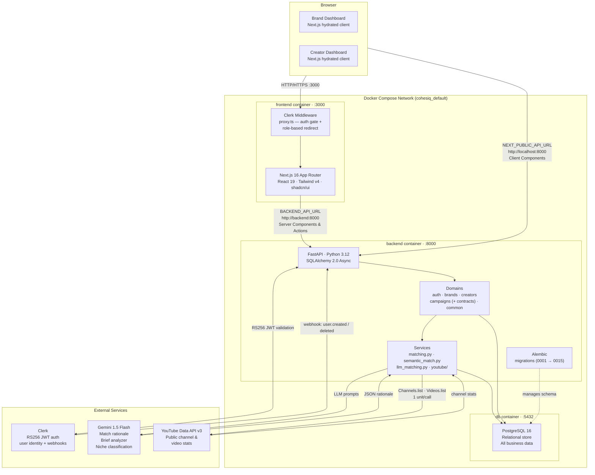
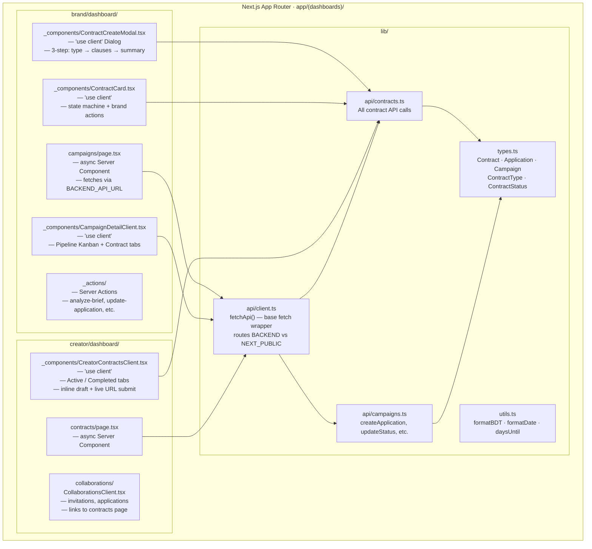
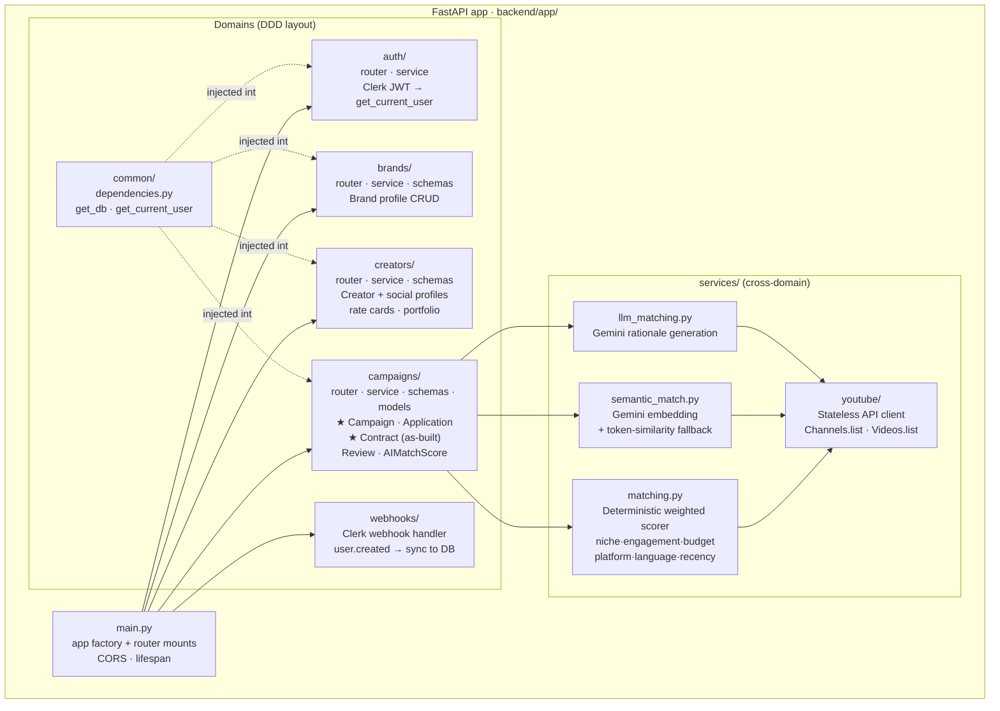

# Architecture Diagram

> **As-built system architecture** — reflects what is actually running in Docker Compose.
> Focuses on *how the system is deployed and structured* — not what data flows where (see `dfd.md`).
>
> Two views are provided:
> 1. **Runtime topology** — containers, ports, network, and external services
> 2. **Internal structure** — Next.js rendering model and FastAPI domain layout

---

## 1. Runtime Topology



---

## 2. Internal Structure

### 2a. Next.js — Server / Client Island Pattern



### 2b. FastAPI — Domain Structure



---

## 3. Request Paths

### Brand: "Run Matching"
```
Browser → Next.js (Client) → POST http://localhost:8000/campaigns/{id}/run-matching
→ FastAPI → campaigns/router → campaigns/service → services/matching.py
→ services/semantic_match.py (Gemini embedding)
→ services/llm_matching.py (Gemini rationale, top-N only)
→ ai_match_scores (INSERT / UPDATE) → PostgreSQL
→ JSON response → CampaignDetailClient (Matches tab)
```

### Brand: "Accept Creator → Create Contract"
```
Browser → ApplicationDrawer "Accept & Set Contract Terms" button
→ Server Action: updateApplicationStatus(accepted)
→ PATCH http://localhost:8000/campaigns/{id}/applications/{appId} → PostgreSQL
→ ContractCreateModal opens (client-side)
→ Step 1: choose type → Step 2: clauses → Step 3: review fee breakdown
→ POST http://localhost:8000/campaigns/{id}/applications/{appId}/contract
→ FastAPI: campaigns/service.create_contract
→ platform_fee_percentage locked from CONTRACT_FEE_MAP
→ contracts INSERT → PostgreSQL
→ Modal closes → CampaignDetailClient switches to "Contracts" tab
```

### Creator: "Submit Draft Content"
```
Browser → CreatorContractsClient draft URL input + submit
→ PATCH http://localhost:8000/contracts/{id}/submit-draft
→ FastAPI: campaigns/service.submit_content_draft
→ validates status == active | in_production, validates creator ownership
→ contracts UPDATE (draft_content_url, status → content_submitted, submitted_at)
→ PostgreSQL → response → UI updates status chip + next-action callout
```

---

## 4. Environment Variables

| Variable | Consumed by | Value in Docker |
|---|---|---|
| `BACKEND_API_URL` | Server Components, Server Actions | `http://backend:8000` |
| `NEXT_PUBLIC_API_URL` | Browser / Client Components | `http://localhost:8000` |
| `CLERK_SECRET_KEY` | FastAPI JWT validation | Clerk dashboard |
| `NEXT_PUBLIC_CLERK_PUBLISHABLE_KEY` | Clerk frontend SDK | Clerk dashboard |
| `GEMINI_API_KEY` | services/llm_matching.py, analyze-brief action | Google AI Studio |
| `DATABASE_URL` | SQLAlchemy engine (backend) | `postgresql+asyncpg://…@db:5432/cohesiq` |

> **Critical rule:** Never use `BACKEND_API_URL` in a Client Component — it is not exposed to the browser. Never use `NEXT_PUBLIC_API_URL` in a Server Component — it routes to localhost which is not reachable from inside the Docker network.
