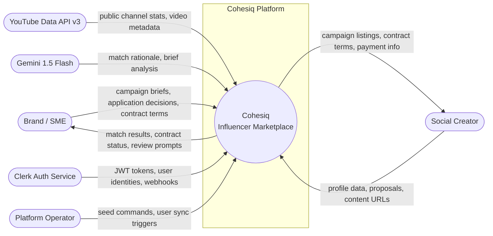

# Data Flow Diagram (DFD)

> **Level 1 DFD** — shows how data moves through Cohesiq's major processes.
> Focuses on *what data* flows *between what* — not how the system is deployed (see `architecture.md`).
>
> Notation used in Mermaid approximation:
> - **Rectangles** (`[Name]`) — External entities (data sources/sinks outside the system)
> - **Stadiums** (`([Name])`) — Processes (transform or act on data)
> - **Cylinders** (`[(Name)]`) — Data stores (persistent data at rest)

---

## Context Diagram (Level 0)

---

## Level 1 DFD — Major Processes

```mermaid
flowchart TB
    %% ── EXTERNAL ENTITIES ──────────────────────────────────────
    Brand[Brand]
    Creator[Creator]
    Operator[Operator]
    Clerk[Clerk Auth]
    YouTube[YouTube API]
    Gemini[Gemini API]

    %% ── DATA STORES ────────────────────────────────────────────
    DS1[(D1 Users and Profiles)]
    DS2[(D2 Campaigns and Applications)]
    DS3[(D3 Contracts)]
    DS4[(D4 Match Scores)]
    DS5[(D5 Reviews)]

    %% ── PROCESSES ──────────────────────────────────────────────
    P1([P1 Auth and Onboarding])
    P2([P2 Campaign Creation])
    P3([P3 Creator Profile Build])
    P4([P4 AI Matching Engine])
    P5([P5 Application Pipeline])
    P6([P6 Contract Management])
    P7([P7 Content Execution])
    P8([P8 Data Ingestion])

    %% ── P1: AUTH & ONBOARDING ──────────────────────────────────
    Brand   -->|register or login| P1
    Creator -->|register or login| P1
    P1      -->|JWT validation request| Clerk
    Clerk   -->|verified identity + role| P1
    Clerk   -->|user.created webhook| P1
    P1      -->|user record and role| DS1

    %% ── P2: CAMPAIGN CREATION ──────────────────────────────────
    Brand   -->|title, brief, budget, visibility, requirements| P2
    P2      -->|brief text for analysis| Gemini
    Gemini  -->|suggested visibility, niche, hashtags| P2
    DS1     -->|brand profile| P2
    P2      -->|campaign record| DS2

    %% ── P3: CREATOR PROFILE BUILD ──────────────────────────────
    Creator -->|display name, niches, languages, social handles, rate cards| P3
    P3      -->|creator profile and social profiles| DS1

    %% ── P4: AI MATCHING ENGINE ─────────────────────────────────
    Brand   -->|run matching trigger| P4
    DS2     -->|campaign niche, budget, platform, language| P4
    DS1     -->|creator followers, engagement, niches, rate cards| P4
    P4      -->|top-N creator IDs for rationale| Gemini
    Gemini  -->|match rationale text| P4
    P4      -->|scored and ranked results| DS4
    DS4     -->|ranked creator cards with rationale| Brand

    %% ── P5: APPLICATION PIPELINE ───────────────────────────────
    Creator -->|proposal text and proposed rate| P5
    Brand   -->|invitation to creator| P5
    Brand   -->|shortlist or accept or reject decision| P5
    Creator -->|accept or decline invitation| P5
    P5      -->|application record| DS2
    P5      -->|updated application status| DS2
    DS2     -->|kanban application list| Brand
    DS2     -->|my applications and invitations| Creator

    %% ── P6: CONTRACT MANAGEMENT ────────────────────────────────
    Brand   -->|contract type and clause configuration| P6
    DS2     -->|accepted application with IDs| P6
    P6      -->|contract record — status active| DS3
    P6      -->|platform fee locked at creation| DS3
    DS3     -->|contract details and state| Brand
    DS3     -->|contract details and next action| Creator

    %% ── P7: CONTENT EXECUTION ──────────────────────────────────
    Creator -->|draft content URL| P7
    P7      -->|draft URL — status content_submitted| DS3
    DS3     -->|draft URL for review| Brand
    Brand   -->|approve or request revision| P7
    P7      -->|status update and revision count| DS3
    Creator -->|live post URL| P7
    P7      -->|live URL — status published| DS3
    Brand   -->|close contract| P7
    P7      -->|status closed| DS3
    P7      -->|application status completed| DS2
    Brand   -->|rating and review text| P7
    Creator -->|rating and review text| P7
    P7      -->|review record| DS5
    DS5     -->|average rating update| DS1

    %% ── P8: DATA INGESTION ─────────────────────────────────────
    Operator  -->|seed and sync commands| P8
    YouTube   -->|channel stats: followers, views, engagement| P8
    P8        -->|creator social profile data| DS1
```

---

## Data flow annotations

| Flow | What moves | Why it matters |
|---|---|---|
| Brand → P2 → Gemini → P2 | campaign brief text | AI Brief Analyzer pre-fills wizard fields; brand always edits before submit |
| P4 → Gemini → P4 | top-N creator IDs + brief | LLM only sees top candidates (not all); rationale generation is the last gate, not the first |
| P6 locks `platform_fee_percentage` | fee % at contract creation time | Future platform fee changes don't retroactively affect in-flight contracts |
| P7 → DS3 (revisions_used++) | revision counter | Enforces `max_revision_rounds` limit — 3rd revision request rejected at service layer (HTTP 409) |
| P7 → DS2 (application.status = completed) | status transition | Completing a contract makes the application review-eligible (both parties can now leave a review) |
| Clerk → P1 (webhook) | user created / deleted events | Backend user record stays in sync with Clerk identity provider |
| YouTube → P8 → DS1 | public channel stats | Overwrites self-reported metrics on `creator_social_profiles` with API-verified values |
