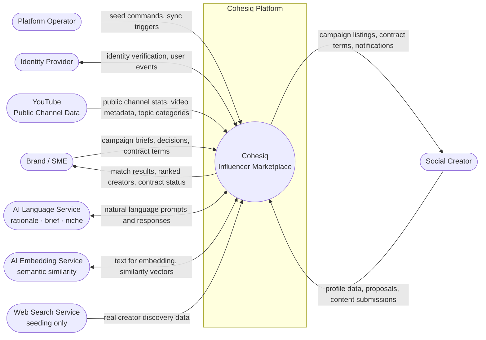

# Data Flow Diagram (DFD)

> **Logical view** — shows what data moves through the system and how it is transformed.
> Technology-agnostic: does not specify Docker, PostgreSQL, FastAPI, React, or any vendor.
> For physical deployment and technology stack, see `architecture.md`.
>
> Notation:
> - **Rounded rectangles** (`([Name])`) — External entities (people or systems outside Cohesiq)
> - **Stadiums** (`([Name])`) — Processes (transform or act on data)
> - **Cylinders** (`[(Name)]`) — Data stores (persistent data at rest)
> - **Arrows** — labeled with the *data payload* only, not the mechanism or condition

---

## Context Diagram (Level 0)

The system as a black box. Eight external actors exchange data with Cohesiq.

---

## Level 1 DFD — Major Processes

```mermaid
flowchart TB
    %% ── EXTERNAL ENTITIES ──────────────────────────────────────
    Brand([Brand])
    Creator([Creator])
    Operator([Operator])
    Auth([Identity Provider])
    YouTube([YouTube\nPublic Channel Data])
    LLMSvc([AI Language Service])
    EmbedSvc([AI Embedding Service])
    SearchSvc([Web Search Service])

    %% ── DATA STORES ────────────────────────────────────────────
    D1[(D1\nUser & Profile Data)]
    D2[(D2\nCampaign &\nApplication Data)]
    D3[(D3\nContract Data)]
    D4[(D4\nMatch Scores)]
    D5[(D5\nReviews)]
    D6[(D6\nCreator Portfolio)]

    %% ── PROCESSES ──────────────────────────────────────────────
    P1([P1\nIdentity &\nOnboarding])
    P2([P2\nCampaign\nCreation])
    P3([P3\nCreator Profile\nManagement])
    P4([P4\nAI Matching\n& Ranking])
    P5([P5\nApplication\nPipeline])
    P6([P6\nContract\nManagement])
    P7([P7\nContent\nExecution])
    P8([P8\nCreator Data\nEnrichment])

    %% ── P1: IDENTITY & ONBOARDING ──────────────────────────────
    Brand   -->|registration details, role| P1
    Creator -->|registration details, role| P1
    P1      <-->|identity token, user events| Auth
    P1      -->|verified user record| D1

    %% ── P2: CAMPAIGN CREATION ──────────────────────────────────
    Brand   -->|title, brief, budget, platforms, requirements| P2
    P2      -->|campaign brief| LLMSvc
    LLMSvc  -->|suggested campaign type, niche, hashtags, KPIs| P2
    D1      -->|brand profile| P2
    P2      -->|campaign record| D2

    %% ── P3: CREATOR PROFILE MANAGEMENT ─────────────────────────
    Creator -->|name, niches, languages, social handles, rate cards| P3
    P3      -->|creator profile| D1

    P3      -->|channel identifier| YouTube
    YouTube -->|channel stats, video metadata, topic categories| P3
    P3      -->|channel and video descriptions| LLMSvc
    LLMSvc  -->|inferred content niche| P3
    P3      -->|verified channel profile| D1
    P3      -->|recent video items| D6

    %% ── P4: AI MATCHING & RANKING ──────────────────────────────
    Brand   -->|match request| P4
    D2      -->|campaign requirements| P4
    D1      -->|creator profiles| P4
    D6      -->|recent content items| P4

    P4      -->|campaign and creator text| EmbedSvc
    EmbedSvc -->|semantic similarity score| P4

    P4      -->|top candidate profiles and campaign brief| LLMSvc
    LLMSvc  -->|match rationale| P4

    P4      -->|ranked matches with scores and rationale| D4
    D4      -->|ranked creator cards with explanations| Brand

    %% ── P5: APPLICATION PIPELINE ───────────────────────────────
    Creator -->|proposal text, proposed rate| P5
    Brand   -->|invitation to creator| P5
    Brand   -->|shortlist, accept, or reject decision| P5
    Creator -->|accept or decline invitation| P5
    P5      -->|application record| D2
    P5      -->|status update| D2
    D2      -->|application list| Brand
    D2      -->|applications and invitations| Creator

    %% ── P6: CONTRACT MANAGEMENT ────────────────────────────────
    Brand   -->|contract type, clause configuration| P6
    D2      -->|accepted application| P6
    P6      -->|contract terms and status| D3
    D3      -->|contract details and state| Brand
    D3      -->|contract details and next action| Creator

    %% ── P7: CONTENT EXECUTION ──────────────────────────────────
    Creator -->|draft content link| P7
    P7      -->|draft submission| D3
    D3      -->|draft link| Brand
    Brand   -->|approval or revision request| P7
    P7      -->|status update| D3
    Creator -->|published content link| P7
    P7      -->|live content link| D3
    Brand   -->|close instruction| P7
    P7      -->|closed status| D3
    P7      -->|collaboration completed| D2
    Brand   -->|rating and review| P7
    Creator -->|rating and review| P7
    P7      -->|review record| D5
    D5      -->|updated average rating| D1

    %% ── P8: CREATOR DATA ENRICHMENT ─────────────────────────────
    Operator  -->|seed and sync commands| P8

    P8      -->|channel identifier| YouTube
    YouTube -->|channel stats, video metadata, topic categories| P8
    P8      -->|channel and video descriptions| LLMSvc
    LLMSvc  -->|inferred niche label| P8

    P8      -->|creator search query| SearchSvc
    SearchSvc -->|creator discovery results| P8
    P8      -->|profile generation prompt| LLMSvc
    LLMSvc  -->|synthetic creator and brand profiles| P8

    P8      -->|normalised creator profiles| D1
    P8      -->|video portfolio items| D6
```

---

## Data Flow Annotations

| Arrow | Data payload | Significance |
|---|---|---|
| Brand → P2 → LLM → P2 | Campaign brief | AI brief analyzer extracts structure from free text; brand reviews and edits before saving |
| P4 → EmbedSvc → P4 | Campaign and creator text | Semantic similarity used as a rescue signal when niche matching fails; score is capped to prevent overriding hard mismatches |
| P4 → LLM → P4 | Top candidate profiles and brief | Rationale generated on top candidates only, after all scoring is complete |
| P4 → D4 | Ranked matches with scores and rationale | Six scoring signals surfaced to brand UI; semantic score shown only when rescue fired |
| P3 → YouTube → P3 | Channel identifier → channel stats | API-verified stats overwrite self-reported data; creator profile flagged as verified |
| P3 → LLM → P3 | Channel and video descriptions | Niche inferred from content text when platform topic data is insufficient |
| P3 → D6 | Recent video items | Portfolio items drive recency scoring in P4 |
| P6 → D3 | Contract terms and status | Platform fee percentage is locked at contract creation and cannot be changed retroactively |
| P7 → D3 (revision count) | Status update | Each revision request increments a counter; further requests are rejected once the limit is reached |
| P7 → D2 | Collaboration completed | Marks the application as review-eligible for both parties |
| P8 → D1 | Normalised creator profiles | All ingested data is tagged with a provenance label (verified, estimated, or self-reported) for ethical-AI disclosure in the UI |
| SearchSvc → P8 | Creator discovery results | Seeding-only path; never triggered by brand or creator user flows |
