```mermaid
erDiagram

    %% ─── IDENTITY ───────────────────────────────────────────────
    USERS {
        uuid    id          PK
        string  email       UK
        string  clerk_id    UK
        enum    role        "brand | creator | admin"
        bool    is_active
        ts      created_at
    }

    USERS ||--o| CREATOR_PROFILES   : "has profile"
    USERS ||--o| BRAND_PROFILES     : "has profile"

    %% ─── CREATOR ────────────────────────────────────────────────
    CREATOR_PROFILES {
        uuid    id                      PK
        uuid    user_id                 FK
        string  display_name
        string  city
        bool    is_available
        int     min_budget_bdt
        int     total_collaborations
        decimal average_rating
        ts      created_at
    }

    CREATOR_PROFILES ||--o{ CREATOR_SOCIAL_PROFILES       : "has"
    CREATOR_PROFILES ||--o{ CREATOR_NICHES                : "tagged with"
    CREATOR_PROFILES ||--o{ CREATOR_LANGUAGES             : "speaks"
    CREATOR_PROFILES ||--o{ CREATOR_RATE_CARDS            : "charges"
    CREATOR_PROFILES ||--o{ CREATOR_PORTFOLIO_ITEMS       : "showcases"
    CREATOR_PROFILES ||--o{ CREATOR_COLLABORATION_HISTORY : "history"

    CREATOR_SOCIAL_PROFILES {
        uuid    id                  PK
        uuid    creator_id          FK
        enum    platform            "youtube | instagram | facebook | tiktok | …"
        string  handle
        int     follower_count
        decimal engagement_rate
        int     avg_views_per_post
        bool    is_primary_platform
        ts      stats_reported_at
    }

    CREATOR_RATE_CARDS {
        uuid    id              PK
        uuid    creator_id      FK
        enum    platform
        enum    deliverable_type "dedicated_video | short_video | photo_post | …"
        int     price_bdt
        bool    is_negotiable
        bool    is_active
    }

    CREATOR_PORTFOLIO_ITEMS {
        uuid    id          PK
        uuid    creator_id  FK
        enum    platform
        string  content_url
        string  title
        bool    is_featured
    }

    CREATOR_COLLABORATION_HISTORY {
        uuid    id                  PK
        uuid    creator_id          FK
        uuid    brand_id            FK "nullable — if brand is on platform"
        string  brand_name
        enum    collaboration_type
        date    collaborated_on
    }

    %% ─── BRAND ──────────────────────────────────────────────────
    BRAND_PROFILES {
        uuid    id              PK
        uuid    user_id         FK
        string  brand_name
        int     niche_id        FK
        bool    is_verified
        int     total_campaigns
        decimal average_rating
        ts      created_at
    }

    %% ─── LOOKUP TABLES ──────────────────────────────────────────
    NICHES {
        int     id      PK
        string  name    UK
        string  slug    UK
        int     parent_id FK "self-ref — hierarchy"
    }

    LANGUAGES {
        char2   code    PK "ISO 639-1"
        string  name
        string  native_name
    }

    NICHES    ||--o{ CREATOR_NICHES    : "categorises"
    LANGUAGES ||--o{ CREATOR_LANGUAGES : "spoken by"
    NICHES    ||--o{ BRAND_PROFILES    : "industry"

    CREATOR_NICHES {
        uuid    creator_id  FK
        int     niche_id    FK
        bool    is_primary
    }

    CREATOR_LANGUAGES {
        uuid    creator_id      FK
        char2   language_code   FK
        bool    is_primary
    }

    %% ─── CAMPAIGNS ──────────────────────────────────────────────
    BRAND_PROFILES ||--o{ CAMPAIGNS : "runs"

    CAMPAIGNS {
        uuid        id                      PK
        uuid        brand_id                FK
        string      title
        text        description
        int         primary_niche_id        FK
        int         budget_per_creator_min
        int         budget_per_creator_max
        int         creator_min_followers
        array       required_platforms
        enum        status                  "draft | active | in_progress | completed | cancelled | archived"
        enum        visibility              "public | private"
        date        application_deadline
        jsonb       kpi_targets
        array       hashtags
        ts          created_at
    }

    CAMPAIGNS ||--o{ CAMPAIGN_NICHE_TARGETS             : "targets"
    CAMPAIGNS ||--o{ CAMPAIGN_LANGUAGE_TARGETS          : "requires"
    CAMPAIGNS ||--o{ CAMPAIGN_DELIVERABLE_REQUIREMENTS  : "expects"
    CAMPAIGNS ||--o{ CAMPAIGN_APPLICATIONS              : "receives"
    CAMPAIGNS ||--o{ AI_MATCH_SCORES                    : "scored by"

    CAMPAIGN_NICHE_TARGETS {
        uuid    campaign_id FK
        int     niche_id    FK
    }

    CAMPAIGN_LANGUAGE_TARGETS {
        uuid    campaign_id     FK
        char2   language_code   FK
        bool    is_required
    }

    CAMPAIGN_DELIVERABLE_REQUIREMENTS {
        uuid    id              PK
        uuid    campaign_id     FK
        enum    platform
        enum    deliverable_type
        int     quantity
        text    notes
    }

    %% ─── APPLICATIONS (matching bridge) ─────────────────────────
    CREATOR_PROFILES ||--o{ CAMPAIGN_APPLICATIONS : "submits"

    CAMPAIGN_APPLICATIONS {
        uuid    id              PK
        uuid    campaign_id     FK
        uuid    creator_id      FK
        string  initiated_by    "creator | brand"
        text    proposal_text
        int     proposed_rate
        enum    status          "pending | shortlisted | accepted | rejected | withdrawn | completed | invited | declined"
        text    rejection_reason
        int     agreed_rate
        ts      applied_at
        ts      accepted_at
        ts      completed_at
    }

    CAMPAIGN_APPLICATIONS ||--o| CONTRACTS  : "becomes"
    CAMPAIGN_APPLICATIONS ||--o{ REVIEWS    : "receives"

    %% ─── CONTRACTS (first-class entity — migration 0015) ────────
    BRAND_PROFILES   ||--o{ CONTRACTS : "party to"
    CREATOR_PROFILES ||--o{ CONTRACTS : "party to"

    CONTRACTS {
        uuid    id                      PK
        uuid    application_id          FK  "UNIQUE"
        uuid    brand_id                FK
        uuid    creator_id              FK
        enum    contract_type           "content_collaboration | product_seeding | talent_engagement"
        enum    status                  "active | in_production | content_submitted | content_approved | published | closed | disputed"
        string  payment_structure       "flat_fee | none"
        int     payment_amount_bdt
        enum    payment_schedule        "upfront | on_delivery | milestone"
        bool    has_product_transfer
        enum    product_disposition     "keep | return"
        text    deliverable_notes
        int     exclusivity_days
        int     usage_rights_days
        int     max_revision_rounds
        int     revisions_used
        int     kill_fee_percentage
        int     platform_fee_percentage "15 | 10 | 18"
        text    draft_content_url
        text    live_post_url
        ts      contracted_at
        ts      submitted_at
        ts      approved_at
        ts      published_at
        ts      closed_at
    }

    %% ─── REVIEWS ────────────────────────────────────────────────
    REVIEWS {
        uuid    id                  PK
        uuid    application_id      FK
        uuid    reviewer_brand_id   FK "nullable"
        uuid    reviewer_creator_id FK "nullable"
        uuid    reviewee_brand_id   FK "nullable"
        uuid    reviewee_creator_id FK "nullable"
        int     rating              "1–5"
        text    review_text
        bool    is_public
        ts      created_at
    }

    %% ─── AI MATCHING ─────────────────────────────────────────────
    CREATOR_PROFILES ||--o{ AI_MATCH_SCORES : "ranked in"

    AI_MATCH_SCORES {
        uuid    id              PK
        uuid    campaign_id     FK
        uuid    creator_id      FK
        float   score_niche
        float   score_engagement
        float   score_budget
        float   score_language
        float   score_total
        text    rationale
        ts      generated_at
    }
```

# Entity Relationship Diagram

> **As-built** — reflects the live PostgreSQL schema (migration `0017_restore_social_creator_platform_unique` at head).
> The SRS aspirational diagram (§9.2) has been superseded by this file.
> See `docs/schema.md` for full DDL and `docs/srs-revisions.md` for the Contract change request.

---

---

## Key design decisions

| Decision | Rationale |
|---|---|
| `contracts.application_id` is `UNIQUE` | One contract per application — enforced at DB level, not just application logic |
| `campaign_type` not shown | Deprecated (nullable, no new writes) — column exists for backward compat; will be `DROP`ped in a future migration |
| `campaigns.visibility` replaces `campaign_type` as the campaign-level discriminator | Public = open marketplace; Private = brand-initiated invite |
| Contract has direct `brand_id` + `creator_id` FKs despite being reachable via `application` | Enables efficient `WHERE brand_id = ?` / `WHERE creator_id = ?` queries without joining through applications |
| `platform_fee_percentage` stored on contract at creation time | Locks the fee at the moment of agreement; future fee changes don't retroactively affect existing contracts |
