```mermaid
flowchart LR
    %% ── ACTORS ────────────────────────────────────────────────
    Brand([👤 Brand / SME])
    Creator([👤 Social Creator])
    Operator([👤 Platform Operator])
    Admin([👤 Platform Admin])
    Clerk([⚙️ Clerk Auth])
    Groq([⚙️ Groq LLaMA + Whisper])
    Gemini([⚙️ Gemini fallback])
    YouTube([⚙️ YouTube Data API v3])

    %% ── IDENTITY & ONBOARDING ─────────────────────────────────
    subgraph SB_Identity[Identity & Onboarding]
        UC1((Register / Login))
        UC2((Select Role\nbrand or creator))
        UC3((Complete Brand Profile))
        UC4((Complete Creator Profile))
        UC5((Add Social Profiles\n& Rate Cards))
        UC6((View Profile-Strength Meter))
    end

    %% ── CAMPAIGN MANAGEMENT ───────────────────────────────────
    subgraph SB_Campaign[Campaign Management]
        UC7((Create Campaign\nvia 4-step wizard))
        UC7a((Dictate Brief by Voice\nGroq Whisper STT))
        UC7b((Import Brief from PDF\nin-browser extract))
        UC8((Set Visibility\nPublic or Private))
        UC9((Set BDT Budget\n& Creator Requirements))
        UC10((Analyze Brief\nwith AI))
        UC11((Edit Campaign))
        UC12((Invite Creator\nto Private Campaign))
    end

    %% ── MATCHING & DISCOVERY ──────────────────────────────────
    subgraph SB_Match[Matching & Discovery]
        UC13((Run AI Matching))
        UC14((View Ranked Creator Cards\nwith Match Score))
        UC15((View Score Breakdown\n6 sub-scores + rationale))
        UC16((Browse Creator Profiles))
        UC17((Compare Creators\nside-by-side))
        UC18((View Rate Benchmarks))
        UC19((Use ROI Calculator))
    end

    %% ── APPLICATION PIPELINE ──────────────────────────────────
    subgraph SB_Pipeline[Application Pipeline — Kanban]
        UC20((Apply to Campaign))
        UC21((Accept Invitation\nfrom Brand))
        UC22((Shortlist Applicant))
        UC24((Reject Applicant\nwith reason))
        UC25((Withdraw Application))
    end

    %% ── OFFER & NEGOTIATION (migration 0022) ──────────────────
    subgraph SB_Offer[Offer & Negotiation]
        UC44((Send Offer\ntype · clauses · deliverable subset · rate))
        UC45((Counter-Offer\neither party · message + terms))
        UC46((Accept Offer\nactivates contract))
        UC47((Decline / Walk Away\nfrom open offer))
    end

    %% ── CONTRACT MANAGEMENT ───────────────────────────────────
    subgraph SB_Contract[Contract Management]
        UC26((Choose Engagement Type\nContent · Product · Talent))
        UC27((Configure Contract Clauses\npayment · revisions · exclusivity))
        UC28((Review Contract Summary\nwith fee breakdown))
        UC29((View Active Contracts))
        UC30((Track Contract Status\nstate machine))
    end

    %% ── PLATFORM ADMINISTRATION ───────────────────────────────
    subgraph SB_Admin[Platform Administration]
        UC48((View Platform Stats\nusers · campaigns · reviews))
        UC49((Manage Users\nlist · toggle active · delete))
        UC50((Moderate Campaigns\nlist · update status))
        UC51((Moderate Reviews\nlist · delete))
        UC52((Archive Campaign))
    end

    %% ── CONTENT EXECUTION ─────────────────────────────────────
    subgraph SB_Execution[Content Execution]
        UC31((Submit Draft Content URL))
        UC32((Approve Content))
        UC33((Request Revision))
        UC34((Submit Live Post URL))
        UC35((Close Contract))
        UC36((Leave Review))
    end

    %% ── CREATOR EXPERIENCE ────────────────────────────────────
    subgraph SB_Creator[Creator Experience]
        UC37((Browse Public Campaigns))
        UC38((View My Collaborations))
        UC39((View My Contracts\nnext-action callout))
        UC40((View Earnings\n& Agreed Rates))
    end

    %% ── OPERATIONS ────────────────────────────────────────────
    subgraph SB_Ops[Platform Operations]
        UC41((Seed Demo Data))
        UC42((Sync Clerk Users))
        UC43((Run Matching\nfor seeded campaigns))
    end

    %% ── BRAND LINKS ───────────────────────────────────────────
    Brand --- UC1 & UC2 & UC3
    Brand --- UC7 & UC7a & UC7b & UC8 & UC9 & UC10 & UC11 & UC12
    Brand --- UC13 & UC14 & UC15 & UC16 & UC17 & UC18 & UC19
    Brand --- UC22 & UC24
    Brand --- UC44 & UC45 & UC46 & UC47
    Brand --- UC26 & UC27 & UC28 & UC29 & UC30
    Brand --- UC32 & UC33 & UC35 & UC36

    %% ── CREATOR LINKS ─────────────────────────────────────────
    Creator --- UC1 & UC2 & UC4 & UC5 & UC6
    Creator --- UC20 & UC21 & UC25
    Creator --- UC45 & UC46 & UC47
    Creator --- UC37 & UC38 & UC39 & UC40
    Creator --- UC31 & UC34 & UC36

    %% ── OPERATOR LINKS ────────────────────────────────────────
    Operator --- UC41 & UC42 & UC43

    %% ── ADMIN LINKS ───────────────────────────────────────────
    Admin --- UC48 & UC49 & UC50 & UC51 & UC52

    %% ── SYSTEM / INCLUDE-EXTEND ───────────────────────────────
    UC1  -.includes.->  Clerk
    UC7a -.includes.->  Groq
    UC10 -.includes.->  Groq
    UC10 -.fallback.->  Gemini
    UC13 -.includes.->  Groq
    UC13 -.fallback.->  Gemini
    UC15 -.includes.->  Groq
    UC5  -.includes.->  YouTube
    UC41 -.includes.->  YouTube

    UC22 -.enables.->   UC44
    UC44 -.opens.->     UC26
    UC26 -.next step.-> UC27
    UC27 -.next step.-> UC28
    UC44 -.triggers.->  UC45
    UC45 -.triggers.->  UC46
    UC45 -.triggers.->  UC47
    UC46 -.activates.-> UC29
    UC31 -.triggers.->  UC32
    UC31 -.triggers.->  UC33
    UC33 -.extends.->   UC30
    UC34 -.triggers.->  UC35
    UC35 -.triggers.->  UC36

    UC8  -.determines.-> UC12
    UC12 -.triggers.->   UC21
```

# Use Case Diagram

> **As-built** — updated for the Contract entity change request (2026-06-06) and the
> offer-driven negotiation lifecycle (migration 0022).
> The original SRS §9.1 diagram placed "Choose Collaboration Type" on the Campaign actor path.
> That use case has been moved to the Contract actor path (see §3 of `docs/revisions/srs-revisions-26-06-06.md`).
>
> Mermaid has no native UML use-case shape. Actors and use cases are modelled as a flowchart
> with `subgraph` system boundaries — the conventional Mermaid convention for UML use cases.
>
> **Validated against** (2026-06-10): `backend/app/campaigns/router.py` (offer/negotiate routes),
> `backend/app/admin/router.py`, `frontend/cohesiq-v0/app/(admin)/admin`,
> `frontend/cohesiq-v0/app/(dashboards)/brand/dashboard/campaigns/new/_components/StepIntro.tsx`,
> `frontend/cohesiq-v0/components/negotiation/NegotiationDrawer.tsx`,
> `frontend/cohesiq-v0/app/api/transcribe/route.ts`.
>
> **Changelog (corrections applied 2026-06-10):**
> - Added voice (Whisper STT) and PDF brief input to "Create Campaign" (UC7a / UC7b).
> - Added the multi-turn negotiation use cases: Send Offer, Counter-Offer, Accept/Decline Offer
>   (UC44–UC47), replacing the implicit "accept → contract modal" trigger.
> - Added an **Admin** actor with platform-moderation use cases (UC48–UC52).
> - Clarified that an accepted offer (not a standalone "Accept Applicant" button) is what
>   activates the contract.

---



---

## Use case summary

### Brand journey
```
Register → Create Campaign (voice / PDF / typed brief → AI suggestions; set visibility, budget, requirements)
→ Run Matching → Review scored creator cards
→ Shortlist → Send Offer (type + clauses + deliverable subset + rate)
→ Negotiate (counter-offers, live 4 s polling) → Offer accepted ⇒ Contract active
→ Wait for draft → Approve or Request Revision
→ Wait for live post → Close Contract → Leave Review
```

### Creator journey
```
Register → Build Profile (social profiles, rate cards, portfolio)
→ Browse public campaigns → Apply with proposal
  OR receive invitation → Accept/Decline
→ Receive offer → Counter-offer or Accept (live negotiation thread)
→ My Contracts → Submit draft URL
→ Await brand approval → Submit live post URL
→ Contract closed → Leave Review
```

### Admin journey
```
Sign in (admin role) → /admin → View platform stats
→ Manage users (toggle active / delete) · Moderate campaigns (update / archive) · Delete reviews
```

### Offer / contract trigger
The contract is created when the brand **sends an offer** (`UC44`, contract status `drafted`),
which opens the engagement-type + clause configuration (`UC26→UC28`). Either party may counter
(`UC45`); accepting the other party's latest offer (`UC46`) flips the contract to `active` and the
application to `accepted`. This is enforced server-side in `campaigns/service.send_offer` /
`accept_offer` — there is no separate "accept applicant" button that bypasses the offer flow.
