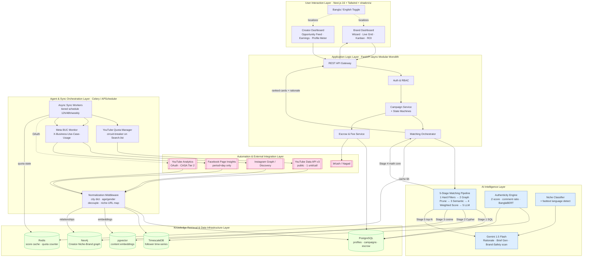

# Cohesiq — Product Requirements & Build Document

**Bangladesh's Creator & Talent Marketplace, powered by Graph AI**

The Infinity AI BuildFest 2026 · MarTech Track · Influencer Matching Engine Challenge
Version 1.0 · Prepared June 2026 · Target outcome: **1st place**

---

## How to read this document

This is the single source of truth that takes Cohesiq from strategy to a build-ready specification. It is sequenced exactly as a winning BuildFest submission should be reasoned: **problem first**, then **who we serve and how we measure success**, then **what data and intelligence powers it**, then **what we must build (requirements)**, then **how we build it in 4 days (user stories + story points)**, and finally **the generation prompts** for the three artefacts judges expect — a use-case diagram, a database schema, and a data-flow / architecture diagram.

Every section is cross-referenced to the BuildFest judging rubric so the team always knows *why* a decision earns points:

| Rubric criterion | Weight | Where this doc earns it |
|---|---|---|
| Innovation | 20% | Problem Statement, AI Logic (opt-in verified data + Graph AI) |
| Technical Execution | 20% | Data Strategy, AI Logic, FR/NFR, Schema prompt |
| Business Model (+ Global Readiness) | 20% | User Segments, KPIs, six collaboration models |
| Real-World Impact (+ Ethical AI) | 20% | Problem Statement, KPIs, NFR (privacy/ethics) |
| Scalability (+ NRB Collaboration) | 10% | NFR, Data Strategy, expansion roadmap |
| Presentation | 10% | Story-point sequencing (presentable-first) + diagrams |

---

# 1. Problem Statement

## 1.1 The core problem

Bangladesh's brand–talent economy runs on **manual, unverifiable, trust-deficient deal-making**. A small or medium brand that wants to run a creator campaign today has to: manually search Facebook/Instagram for creators in a niche, DM 20–30 of them to gauge interest, negotiate price over WhatsApp with no market benchmark, take on faith that a "50K follower" account is real (when **49% of Instagram accounts globally exhibit follower fraud**), send a bKash payment with no contract or delivery guarantee, and then have no way to measure whether the campaign actually worked.

There is **no organised intermediary platform** in this market. Deals happen through DMs, WhatsApp negotiations, and personal connections — the exact stage Upwork solved for freelancing in 2010.

## 1.2 Why this matters now (market timing)

| Metric | Figure | Source |
|---|---|---|
| Bangladesh influencer ad market (2024) | $30.4M | Statista |
| Bangladesh influencer ad market (2028, projected) | $45.3M (10.47% annual growth) | Statista |
| BD creators with 10K+ followers | 500,000+ | Financial Express BD |
| BD active social media users | 50M+ | Financial Express BD |
| Global influencer platform market (2033) | $103.79B at 30.6% CAGR | Straits / Research & Markets |
| Asia-Pacific market CAGR (2026–2031) | 33.90% (highest globally) | Mordor Intelligence |
| Average ROI per $1 spent on influencer marketing | $5.78 | Nielsen |

The structural advantage is that **no organised platform exists yet** in a market that is large, fast-growing, and underserved. Whoever builds the first structured, trusted, BDT-native, Bangla-capable platform owns the default position.

## 1.3 Why existing solutions fail Bangladesh

Every global platform shares four disqualifying characteristics for this market:

1. **USD pricing** — GRIN/Upfluence/Aspire run $2,000–$5,000/month; even Modash at ~$199/month (~BDT 22,000) is beyond most BD SME marketing budgets. A brand spending BDT 10,000 on a micro-campaign cannot afford a $2,000/month subscription.
2. **Western-centric creator databases** — no structured index of Bangladeshi micro-influencers.
3. **No Bangla language support** — English-only search, analytics, and communication.
4. **No local payment rails** — bKash, Nagad, and Rocket exist on none of them.

The lone local incumbent, **HypeScout**, is BDT-priced but first-generation: it lacks deep Graph AI matching, Bengali NLP, cross-platform analytics, and fraud detection.

## 1.4 Why AI is essential (not a gimmick)

This problem is *unsolvable* with a simple directory. It requires AI at the core because:

- **Matching is multi-dimensional and multi-hop.** "Find creators whose niche overlaps with fitness, who have successfully collaborated with health-food brands before, and whose audience is 60%+ female aged 20–35 in Dhaka" is a 3-hop graph traversal, trivial in Neo4j Cypher but unnatural in SQL.
- **Trust must be computed, not claimed.** Authenticity scoring (engagement-vs-tier benchmarks, follower-growth Z-scores, comment-to-like ratios, Bengali comment-quality analysis) is statistical/ML work, not a checkbox.
- **The market is bilingual.** Niche classification, rationale generation, and comment sentiment must work across Bangla, English, and Banglish code-switching — genuine NLP, not string matching.

## 1.5 The solution in one sentence

> **Cohesiq is Bangladesh's Creator & Talent Marketplace — connecting brands with the right content creators, event hosts, brand ambassadors, speakers, and UGC talent for any engagement, powered by Graph AI, opt-in verified data, and BDT-native escrow.**

The decisive innovation is the **"own-platform / opt-in verified data" model**: instead of scraping creators' data from social platforms (blocked, paywalled, legally murky), **creators voluntarily join and authorise sharing their metrics via OAuth in exchange for being discovered by paying brands.** This single architectural shift flips data acquisition from `You → (scraping) → Social Platform → [BLOCKED]` to `Creator → (OAuth/self-reported) → Cohesiq → Brand → [OPEN]`. The data is real, verified, legally clean, and creates a trust foundation no scraping-based competitor can match.

## 1.6 Scope clarification — Talent, not just influencers

Cohesiq is deliberately repositioned from "influencer platform" to **Creator & Talent Marketplace**. "Influencer" is deprecated in all user-facing surfaces (too casual for B2B buyers); **Talent** is the umbrella term, **Creator** the social-content subset. This expands the addressable market to include high-value verticals like **event hosting** (single bookings worth BDT 15,000–80,000), brand ambassadors, speakers, and UGC creators — none of which any Bangladeshi platform currently serves.

---

# 2. User Segments

Cohesiq is a **two-sided marketplace**. Brands are the **revenue engine** (sole source of revenue); talent is the **supply side** that must be seeded first to solve the cold-start problem. A third internal segment (platform operators) is required for trust and moderation.

## 2.1 Demand side — Brands / SMEs (primary, paying)

| Segment | Profile | Core need | Willingness to pay |
|---|---|---|---|
| **Micro-SME brands** | Fashion, food, beauty, D2C shops running BDT 5,000–30,000 campaigns | Find affordable, real micro-creators fast; avoid fraud | Transaction fee; low subscription |
| **Growth SMEs** | Established local brands running 2–5 campaigns/month | Repeatable workflow, ROI tracking, shortlisting | Subscription (cross-over vs. per-deal fee) |
| **Corporate / event buyers** | Companies booking hosts for launches, galas, awards | Availability-based booking, verified references | High-ticket transaction fee |
| **NRB / diaspora brands** | Bangladeshi-owned brands abroad targeting the BD market | Reach BD audiences via local creators remotely | Subscription + transaction |

*Primary persona:* **R12 — a Dhaka fashion SME marketing manager** who needs 10–20 authentic micro-creators within budget, with proof their followers are real, and a contract + payment protection.

## 2.2 Supply side — Talent (must be seeded first)

| Talent type | Profile attributes | Matching basis |
|---|---|---|
| **Social Creators** | niche, sub-niches, engagement rate, follower counts (YT/IG/TikTok), content language | Audience-fit + niche + authenticity |
| **Event Hosts** | event-type specialisations, languages spoken, past-event references, availability calendar | Availability-first, not audience reach |
| **UGC Creators** | portfolio, content formats, avg turnaround, style tags | Portfolio + turnaround fit |
| **Speakers** | expertise areas, credentials, talk titles, keynote fee range | Expertise + credentials |
| **Brand Ambassadors** | long-term availability, niche fit, reliability history | Retainer fit + reputation |

*Primary persona:* **Tania — a Dhaka micro food-creator (18K subscribers, 4.2% engagement)** who currently negotiates over DMs, gets low-balled, has no rate benchmark, and fears non-payment.

## 2.3 Internal — Platform operators

Trust & safety reviewers, editors curating Creator Spotlight / Trending leaderboards, and dispute-resolution staff. They need moderation tools, authenticity-flag queues, and campaign audit trails.

## 2.4 The cold-start strategy (judge-facing answer)

Marketplaces fail at the two-sided cold start. Cohesiq **seeds supply first**: onboard 50 verified creators across 5 niches via direct outreach in existing Facebook creator groups and YouTube creator forums, offering free premium features for the first 6 months. *For the demo*, seed 18–20 **real** Bangladeshi YouTube channels via the public Data API v3 (no OAuth needed) plus proportional synthetic IG/TikTok companion profiles (clearly labelled "Estimated").

---

# 3. KPIs

KPIs are grouped by what they prove. Each maps to a rubric criterion so the team can show measurable impact on demo day.

## 3.1 North-star metric

**GMV facilitated (BDT)** — total value of campaigns transacted through the platform. Everything else is a leading indicator of this.

## 3.2 Marketplace liquidity KPIs (proves Business Model — 20%)

| KPI | Definition | Demo-day target | Mature target |
|---|---|---|---|
| Match-to-shortlist rate | % of AI-matched creators a brand shortlists | ≥ 40% | ≥ 55% |
| Brief-to-booking conversion | % of campaign briefs that result in a booking | demonstrate flow | ≥ 25% |
| Time-to-first-match | Seconds from "Run Matching" to ranked results | < 5 s | < 3 s |
| Repeat-brand rate | % of brands running ≥ 2 campaigns | n/a (demo) | ≥ 35% |
| Take rate | Platform fee ÷ GMV | model only | 8–12% blended |

**Revenue model context (for projections):** 10% fee on paid sponsored content / talent booking; 5% on affiliate & ambassadorship; gifting gated behind subscription. Illustrative scale: 10 deals/day × BDT 7,500 avg × 10% = **BDT 7,500/day ≈ BDT 225,000/month** in commission.

## 3.3 Trust & authenticity KPIs (proves Real-World Impact + Ethical AI — 20%)

| KPI | Definition | Target |
|---|---|---|
| Authenticity coverage | % of creators with a computed Trust Score | 100% of seeded creators |
| Fraud-flag precision | % of flagged accounts that are genuinely suspicious (manually verified) | demonstrate on labelled set |
| Escrow protection rate | % of monetary campaigns passing through escrow | 100% |
| Dispute resolution time | Median hours to resolve a dispute | < 48 h |
| Matching-accuracy proxy | % of 20 manually-labelled historical collaborations the engine correctly predicts as success/fail | report X% (measurable framework) |

## 3.4 AI quality KPIs (proves Technical Execution — 20%)

| KPI | Definition | Target |
|---|---|---|
| Niche-classification accuracy | Correct primary-niche assignment on a 20-title Bangla/Banglish test set | ≥ 85% (Gemini free tier; fallback BanglaBERT) |
| Rationale usefulness | Brand-rated 1–5 on match-explanation clarity | ≥ 4.0 |
| Match-score stability | Score variance on repeated runs of identical inputs | deterministic (0 variance on math core) |
| Demographic data freshness | Max staleness of displayed audience demographics | timestamped, ≤ 48 h labelled |

## 3.5 Supply & engagement KPIs (proves Scalability — 10%)

| KPI | Definition | Target |
|---|---|---|
| Verified creators onboarded | Creators with ≥ 1 OAuth-linked platform | 50 pre-launch / 18–20 demo |
| Profile completeness | Avg profile-strength meter score | ≥ 80% |
| Talent-type coverage | # of the 5 talent types live | ≥ 2 for demo (Creator + Host), 5 at scale |
| Bangla-mode adoption | % of creators onboarding via Bangla UI | track from day 1 |

---

# 4. Data Strategy

The data strategy is the single biggest source of technical-execution points, because it is where most hackathon teams fail invisibly. The governing principle, drawn from the data-availability research, is: **assume every external API is constrained, deprecated, or compliance-gated until proven otherwise, and design around it from day one.**

## 4.1 The opt-in / own-platform data model (the core idea)

Cohesiq does **not** scrape. It acquires data through three legitimate channels, in priority order:

1. **Public APIs, no OAuth** — YouTube Data API v3 channel/video stats. Instant, free, legal.
2. **Creator self-reported at sign-up** — rate cards, platform presence, languages, niches, brand-conflict disclosures.
3. **Creator-authorised OAuth** — YouTube Analytics, Instagram Graph Insights, Facebook Page Insights — unlocked *only* after the creator consents, in exchange for discoverability.

This flips the data problem from adversarial (scraping a hostile, blocked surface) to cooperative (creators *want* to share, to get paid). It is legal, verifiable, and a defensible moat.

## 4.2 Data tiers — what is available when

| Tier | Source | Auth needed | Available | Used for |
|---|---|---|---|---|
| **Tier 0 — Public** | YouTube Data API v3 | API key only | **Instantly** | MVP matching (niche, engagement, tier, language, recency) |
| **Tier 0 — Public** | Instagram Business Discovery | Your own Page token | Instantly | Public follower count, captions, post engagement |
| **Tier 1 — OAuth** | YouTube Analytics API | OAuth + **CASA Tier 2** | Week 6–8 (paid audit) | Country audience, age/gender |
| **Tier 1 — OAuth** | Instagram Graph Insights | OAuth + App Review | Week 4+ | City, demographic breakdown, active hours |
| **Tier 1 — OAuth** | Facebook Page Insights | OAuth + App Review + PPCA | Week 4+ | Fans by city/country/age-gender (day period ONLY) |

**For the BuildFest demo, build entirely on Tier 0** (public YouTube + pre-authorised test accounts for an OAuth demonstration). State openly: *"App Reviews are in progress; this demo shows authenticated analytics from pre-authorised test creator accounts."* All compliance timelines exceed a hackathon window — designing around this is itself a technical-maturity signal to judges.

## 4.3 Hard API constraints the architecture must respect

These are non-negotiable, taken directly from the data-availability research. Ignoring any one forces a mid-project rebuild.

| # | Constraint | Architectural consequence |
|---|---|---|
| 1 | YouTube Analytics needs **CASA Tier 2** (4–8 wk, $1,000–$4,000) | YouTube audience demographics are a Phase-4 feature; never block MVP on it |
| 2 | YouTube gives **country-level only** (ISO `BD`), no city | City concentration must be *inferred cross-platform* and labelled "estimated" |
| 3 | Instagram demographics need **≥100 followers**, return **top 45 segments only** | Nano-influencer demographics are structurally impossible; UI must say "Limited demographic data for nano-tier" |
| 4 | Facebook `period=lifetime` is **deprecated → silent 200 + empty array** | Block `period=lifetime` at the HTTP-client layer; use `period=day`; **assert non-empty response body** |
| 5 | YouTube `Search.list` costs **100 units** (of 10,000/day) | Circuit-breaker permanently disables `Search.list`; discover via creator-submitted Channel IDs + `Channels.list` (1 unit) |
| 6 | Meta **BUC rate limit** is opaque & silent | Parse `X-Business-Use-Case-Usage` on **every** Meta call; exponential backoff at 80% utilisation |
| 7 | Instagram demographics are **≤48 h stale** (no webhooks) | Timestamp all demographic data; display last-updated; treat as eventually consistent |

## 4.4 Normalization middleware (the cross-platform incompatibility layer)

The three platforms encode the same facts incompatibly. A normalization layer at ingestion is mandatory:

- **Geography:** YouTube = `BD` (country); Instagram/Facebook = unstructured city strings (`"Dhaka, Dhaka Division"`, `"ঢাকা"`, `"Dacca"`). → A continuously-maintained `CITY_NORMALIZATION` dictionary maps all variants to a canonical `location_id`. Unrecognised strings go to an `unknown_location` bucket, **never silently dropped**. This is a *living* quarterly-reviewed task, not a one-time job.
- **Age/Gender:** YouTube uses separate `ageGroup` + `gender` fields; Meta uses a combined `"F.18-24"` key. → Always store age and gender in **separate columns**; parse Meta's combined key at ingestion into a unified internal taxonomy (`under_18`, `18_24`, `25_34`, `35_44`, `45_plus`).
- **Niche/category:** YouTube returns Wikipedia URLs (`.../wiki/Technology`), not labels. → A `YOUTUBE_CATEGORY_MAP` dictionary translates URL → internal taxonomy.
- **Shorts views:** post-2025 `viewCount` overstates Shorts engagement (counts any play initiation). → Use `engagedViews`/`engaged_views` for Shorts-heavy channels.
- **Incomplete demographics:** Instagram's top-45 segments sum to < total followers. → Display the remainder explicitly as **"Uncategorized (20.2%)"**; **never** redistribute it (that fabricates demographic signal).

## 4.5 Storage layout

| Store | Holds | Why |
|---|---|---|
| **PostgreSQL** | Creator/brand profiles, campaigns, rate cards, contracts | Relational core, ACID for money |
| **pgvector** | Content embeddings | Semantic brand-brief ↔ creator-content similarity |
| **Neo4j** | Creator–Niche–Brand–Campaign graph | Multi-hop matching, conflict-of-interest, lookalikes |
| **TimescaleDB / Postgres** | Follower-count & engagement time-series | Authenticity Z-scores, growth-spike detection (build day 1 even before scoring is ready) |
| **Redis** | Match-score cache (6 h TTL), YouTube quota counter | Speed + rate-limit safety |

## 4.6 Sync schedule (tiered to protect quota)

| Data | Cadence |
|---|---|
| YouTube public stats — active-campaign creators (Tier 1) | every 12 h |
| YouTube public stats — recent sign-ups (Tier 2) | every 48 h |
| YouTube public stats — dormant (Tier 3) | weekly |
| Instagram public (polling) | 24 h |
| Instagram / Facebook Insights (OAuth) | daily snapshot (`period=day` only) |
| Authenticity score | weekly recomputation |

All external calls run in **async background workers** (Celery / APScheduler) — never on the UI thread.

---

# 5. AI Logic

The AI is the differentiator and the source of technical-execution and innovation points. The guiding principle: **deterministic math decides *who matches*; the LLM only *explains why*.** A pure-LLM matcher hallucinated budget constraints in early testing — so hard constraints (budget, platform, tier) are enforced mathematically *before* any LLM call.

## 5.1 Five-stage matching pipeline (gated funnel)

Each stage is a gate that eliminates unsuitable candidates before more expensive operations run. This is faster, cheaper (no LLM on obviously-wrong matches), and higher-quality than a flat weighted score.

```
Stage 1 — Hard Filters (SQL, instant, binary):
          talent_type match · platform coverage · budget ceiling (rate ≤ budget×1.3) · language requirement
          → eliminates ~70% of candidates at near-zero cost

Stage 2 — Graph Pruning (Neo4j Cypher):
          niche alignment (multi-hop) · conflict-of-interest (collaborated with competitor in last 90 days?) · lookalike expansion

Stage 3 — Semantic Ranking (pgvector cosine):
          brand-brief embedding ↔ creator-content embedding similarity

Stage 4 — Deterministic Weighted Score (the math core, below):
          M1–M6 public metrics → MVP score; +S1–S5 when OAuth data present → v2 score

Stage 5 — LLM Rationale (Gemini free tier, only on top N):
          2–3 sentence Bangla/English explanation of WHY this creator fits this brief
```

## 5.2 Matching metrics — MUST-HAVE (Day 1, all public data, no OAuth)

These six determine whether a match is fundamentally relevant. The platform cannot launch without them.

| ID | Metric | Weight | Logic | Data source |
|---|---|---|---|---|
| **M1** | Content Niche Score | 30% | Primary category match; first filter, not fine-tuner (tech brand ↔ beauty creator = 0/10) | YouTube `topicCategories` → map; IG/FB captions → LLM classify |
| **M2** | Engagement Rate | 20% | `avg(likes+comments)/avg(views)`, last 10 posts; normalise vs tier benchmark (Nano 5–7.2%, Micro 3.86%, Macro 1.5–2%, Mega 1.21%); use `engaged_views` for Shorts | Public per-video stats |
| **M3** | Audience Tier Fit | 20% | Map follower count to Nano/Micro/Macro/Mega; budget is a hard constraint, binary not preference | Subscriber/follower count |
| **M4** | Platform Presence | 15% | Brand needing YouTube content can't match a Facebook-only creator (binary) | Self-reported, OAuth-verified |
| **M5** | Budget Fit | 10% | `1.0` if rate ≤ budget; `0.5` if ≤ budget×1.3 (negotiable); `0.0` if above | Self-reported rate card |
| **M6** | Content Language | 5% | Ratio of Bangla / English / Banglish; export brand needs English-capable creator | `langdetect`/`fasttext` on titles+captions (free, handles Bengali) |

**MVP scoring function (pseudocode):**
```python
def compute_match_score_mvp(brand, creator) -> float:
    scores = {
        "niche":      compute_niche_alignment(brand.category, creator.niche),
        "engagement": normalize_engagement_vs_tier(creator.engagement_rate, creator.tier),
        "budget":     compute_budget_fit(brand.budget_per_creator, creator.rate),
        "platform":   check_platform_coverage(brand.required_platforms, creator.platforms),
        "language":   compute_language_match(brand.target_language, creator.language_profile),
        "recency":    normalize_posting_recency(creator.days_since_last_post),
    }
    weights = {"niche":0.30,"engagement":0.20,"budget":0.20,
               "platform":0.15,"language":0.10,"recency":0.05}
    return sum(scores[k]*weights[k] for k in scores)
```

## 5.3 Matching metrics — SHOULD-HAVE (Phase 2, requires OAuth)

Build after MVP works; each adds accuracy but needs authenticated data.

| ID | Metric | Adds | Logic | Gate |
|---|---|---|---|---|
| **S1** | Audience Geographic Concentration | +15% | % of audience in BD / target city; cross-platform inference for YouTube (labelled "estimated") | IG/FB Insights / CASA Tier 2 |
| **S2** | Audience Age & Gender | +10% | Demographic fit; **flag creators with >20% under-18 audience** for brand-compliance review | IG `follower_demographics` / FB `page_fans_gender_age` |
| **S3** | Audience Authenticity Score | +10% | Composite fraud probability (below) | Mostly public + BanglaBERT |
| **S4** | Conflict-of-Interest | gate | Neo4j traversal: collaborated with competitor in last 90 days? | Platform's own campaign graph |
| **S5** | Brand Safety | gate | LLM batch scan of titles/captions for violent/explicit/controversial content | Gemini free tier |

**v2 scoring function (pseudocode):**
```python
def compute_match_score_v2(brand, creator) -> float:
    base = compute_match_score_mvp(brand, creator) * 0.65
    geo_bonus   = compute_geo_alignment(brand.target_city, creator.audience_geo)      # up to +0.15
    demo_bonus  = compute_demo_alignment(brand.target_demographics, creator.audience) # up to +0.10
    auth_bonus  = creator.authenticity_score * 0.10
    conflict_pen = -0.20 if has_competitor_conflict(brand, creator) else 0.0
    return base + geo_bonus + demo_bonus + auth_bonus + conflict_pen
```

## 5.4 Authenticity engine (the anti-fraud moat)

The #1 brand pain point; no BD platform addresses it. Computed from **public data + free methods**:

| Signal | Formula | Weight |
|---|---|---|
| Engagement vs tier benchmark | how far below 3.86% micro average | 40% |
| Follower growth-spike detection | Z-score on historical follower deltas; Z > 3.0 flags | 25–30% |
| Comment-to-like ratio | bot farms inflate likes, not comments | 25% |
| Follower-to-following ratio | heavy follow-back fraud detection | 10% |
| **BanglaBERT comment quality** | genuine Bengali responses vs emoji-only/copy-paste bot patterns (free, HuggingFace) | qualitative overlay |

Output: Trust Score 0–100 + flag labels + plain-language explanation for the brand. Requires the time-series follower store from day 1.

## 5.5 LLM roles (and where the LLM is *not* trusted)

| Task | Model | Trusted with money/constraints? |
|---|---|---|
| Match rationale (2–3 sentences, Bangla/English) | Gemini 1.5 Flash (free tier) | No — explains, never decides |
| Niche classification from captions/titles | Gemini / BanglaBERT fallback | No — heuristic-validated |
| AI Brief Generator (brand types description → structured campaign params) | Gemini | Output is editable by brand before commit |
| Brand-safety content scan | Gemini batch | Flags for human review, not auto-reject |
| Comment-quality / sentiment | BanglaBERT | Statistical signal only |

**Explainability** (a rubric requirement): every match shows its sub-scores (niche, engagement, budget, …) as a visual breakdown plus the LLM rationale — the brand sees exactly *why* a creator ranked where they did.

---

# 6. Functional Requirements

Organised by module. **P0** = required for a presentable demo; **P1** = contest-strengthening; **P2** = post-contest.

## 6.1 Identity & onboarding
- **FR-1 (P0)** Brands and talent can register, log in, and select a role (brand / talent).
- **FR-2 (P0)** Talent selects a **talent type** (Creator, Host, UGC, Speaker, Ambassador); the profile form adapts to type-specific fields (polymorphic).
- **FR-3 (P0)** Creators submit their YouTube Channel ID / handle; the platform fetches public stats via `Channels.list` (1 unit).
- **FR-4 (P1)** Creators can OAuth-link YouTube/Instagram/Facebook to unlock verified analytics (test accounts for demo).
- **FR-5 (P1)** Profile-strength meter shows completeness and how each field improves match score.

## 6.2 Campaign creation
- **FR-6 (P0)** Brands create a campaign via a guided wizard: Type → Talent Requirements → Budget & Timeline → Brief & Assets, validating each step.
- **FR-7 (P0)** Brands set budget in **BDT** and select one of the six collaboration models.
- **FR-8 (P1)** AI Brief Generator: brand types a Bangla/English description; Gemini pre-fills niche, demographics, format, budget range, suggested tier (brand-editable).

## 6.3 Matching & discovery
- **FR-9 (P0)** "Run Matching" returns a ranked list of creator cards with a 0–100 match score and AI-generated rationale.
- **FR-10 (P0)** Each match exposes its sub-score breakdown (niche, engagement, budget, platform, language, recency).
- **FR-11 (P0)** Live discovery panel updates the matched grid as the brand adjusts filters; clicking a card opens a full profile drawer without leaving the page.
- **FR-12 (P1)** Authenticity / Trust Score shown on every creator card with flag labels and explanation.
- **FR-13 (P1)** Conflict-of-interest filter excludes creators who collaborated with a competitor in the last 90 days (Neo4j).

## 6.4 Collaboration & workflow
- **FR-14 (P0)** Campaign Kanban board with status columns (Applied, Shortlisted, In Progress, Content Review, Completed) and drag-and-drop shortlisting.
- **FR-15 (P0)** Each collaboration type runs an explicit **state machine** with timestamped transitions (audit trail).
- **FR-16 (P1)** Content-review workflow: talent submits draft → brand approves/requests revision → publishes → submits post URL.
- **FR-17 (P1)** Host booking uses **availability-first** matching (date/calendar) rather than audience scoring.

## 6.5 Payments & trust
- **FR-18 (P1)** Escrow ledger holds brand payment; releases to talent within 48 h of approved delivery (bKash/Nagad model).
- **FR-19 (P0, simulated for demo)** Platform fee computed per collaboration type (10% paid/booking; 5% affiliate/ambassador).
- **FR-20 (P2)** Affiliate tracking: per-creator UTM links + promo codes, conversion webhooks, earnings ledger.
- **FR-21 (P1)** Post-engagement metrics pulled at Day 7/14/30 for completed campaigns (ROI summary).

## 6.6 Engagement & vitality
- **FR-22 (P1)** Trending Creators leaderboard (weekly, from stored snapshots) and Creator Spotlight.
- **FR-23 (P1)** Live Activity Feed ("43 campaigns live · 218 active creators · 12 completed this week").
- **FR-24 (P0)** **Full Bangla UI toggle** across all pages.
- **FR-25 (P1)** Creator opportunity feed, earnings dashboard, application-status tracker, rate-card benchmark widget.

## 6.7 Operations & data
- **FR-26 (P0)** Normalization middleware (city dictionary, age/gender decoupling, niche-URL map) runs at ingestion.
- **FR-27 (P1)** Demo seeding pipeline: 18–20 real YouTube channels + proportional synthetic IG/TikTok (labelled "Estimated").
- **FR-28 (P1)** Synthetic/estimated fields visibly tagged; verified fields show a green check.

---

# 7. Non-Functional Requirements

## 7.1 Performance
- **NFR-1** Matching returns in **< 5 s** (target < 3 s) for a brief against the seeded creator set; match scores cached in Redis 6 h.
- **NFR-2** UI never blocks on external API calls — all sync runs in async background workers.

## 7.2 Scalability (rubric: Scalability +NRB — 10%)
- **NFR-3** Modular monolith (FastAPI) with clear service boundaries, deployable to serverless/containerised cloud; stateless API layer.
- **NFR-4** Polymorphic talent model scales to new talent types without schema bloat (base table + extension tables).
- **NFR-5** Cloud-native, multi-region-ready; designed for South/Southeast-Asia expansion (BDT-native, but currency/locale abstracted).

## 7.3 Reliability & data integrity
- **NFR-6** Every Meta call parses `X-Business-Use-Case-Usage`; exponential backoff at 80% BUC utilisation; 3 retries (2/4/8 s) → dead-letter queue with alert.
- **NFR-7** `period=lifetime` blocked at the HTTP-client layer; **assert non-empty response body** after every Insights call (guards the silent-200 bug).
- **NFR-8** YouTube quota manager in Redis; circuit-breaker permanently disables `Search.list`.
- **NFR-9** All demographic data is timestamped; staleness shown in UI; treated as eventually consistent (≤48 h).

## 7.4 Security & compliance
- **NFR-10** OAuth tokens encrypted at rest; least-scope requests; shipping addresses collected via encrypted forms.
- **NFR-11** Demo infrastructure isolated in a dedicated Google Cloud project / burner Workspace account (avoids screencast-ban cascade).
- **NFR-12** Lawful data usage only; creators retain full ownership of their data and can revoke OAuth; participants retain full IP (contest rule).

## 7.5 Ethical AI (rubric: Real-World Impact +Ethical — 20%)
- **NFR-13** **Transparency:** every AI match displays its sub-score breakdown + rationale; no black-box scores.
- **NFR-14** **No fabricated data:** incomplete demographics shown as explicit "Uncategorized %"; remainder never redistributed.
- **NFR-15** **Bias / safety:** under-18-audience flag for age-restricted brands; brand-safety content scan; authenticity flags are advisory + human-reviewable, not silent bans.
- **NFR-16** **No misleading demos:** synthetic/estimated fields clearly labelled; demo explicitly states which data is real vs test-account vs estimated.

## 7.6 Usability & localization
- **NFR-17** Progressive disclosure UX — simple surface, power features revealed on depth; professional for brand managers, accessible for independent creators.
- **NFR-18** Full Bangla + English UI; low-bandwidth-friendly (a stated BuildFest scalability requirement).
- **NFR-19** WCAG-AA-level contrast and keyboard navigation on core flows.

---

# 8. User Stories & Story Points (4-Day Rapid Build)

> **Revisions:** US-5, US-10, and US-16 have been revised, and US-5a/5b/5c added, by the Contract entity change request (2026-06-06). See [`docs/revisions/srs-revisions-26-06-06.md`](revisions/srs-revisions-26-06-06.md) for revised personas, INVEST-compliant stories, use cases, and happy/sad paths.

## 8.1 Estimation scale & philosophy

Story points use a **modified Fibonacci** scale measuring effort + complexity + uncertainty (not hours):

| Points | Meaning |
|---|---|
| 1 | Trivial, well-understood, < ~1 hr |
| 2 | Small, minor unknowns |
| 3 | Moderate, some integration |
| 5 | Substantial, real complexity/integration |
| 8 | Large, significant unknowns — candidate to split |
| 13 | Epic — **must** be split before building |

**Sequencing rule (per your instruction):** *Make it presentable first, then make it win.* Day 1–2 delivers a complete, demoable happy-path (a judge can watch brand → match → ranked creators → rationale end-to-end). Day 3–4 adds the differentiators that move scores from "good student project" to "globally competitive." Assuming a ~3-person build team, target velocity ≈ 18–22 points/day.

## 8.2 PHASE A — Presentable Core (Day 1 → Day 2). The demo must work end-to-end.

| ID | User story | Points | Day |
|---|---|---|---|
| US-1 | As a **user**, I can register and log in as a brand or talent, so I can access the right workspace. | 3 | 1 |
| US-2 | As a **creator**, I can create a profile and submit my YouTube Channel ID, so the platform can fetch my public stats. | 3 | 1 |
| US-3 | As the **platform**, I seed 18–20 real BD YouTube channels via `Channels.list` + proportional synthetic IG/TikTok, so the demo has real, credible data. | 5 | 1 |
| US-4 | As the **platform**, I normalise ingested data (niche-URL map, language detect, tier classify, engagement calc), so matching inputs are clean. | 5 | 1 |
| US-5 | As a **brand**, I create a campaign through a 4-step wizard with a BDT budget and a collaboration type, so I can express what I need. | 5 | 1–2 |
| US-6 | As a **brand**, I click "Run Matching" and get a ranked list of creator cards with a 0–100 score, so I can see who fits. | 5 | 2 |
| US-7 | As a **brand**, I see *why* each creator matched via a sub-score breakdown + a 1-click Gemini rationale (Bangla/English), so I trust the result. | 5 | 2 |
| US-8 | As a **brand**, I browse matches in a live grid and open a full creator profile drawer without leaving the page, so discovery feels fluid. | 3 | 2 |
| US-9 | As a **user**, I can toggle the entire UI to Bangla, so non-English creators/brands can use it. | 3 | 2 |
| US-10 | As a **brand**, I manage applicants on a Kanban board (Applied → Shortlisted → … → Completed), so I can run the campaign. | 3 | 2 |

**Phase A subtotal: 40 points.** Outcome by end of Day 2: a judge can be walked through the entire happy path with real data, AI-ranked matches, explainable scores, and a Bangla UI.

## 8.3 PHASE B — Make It Win (Day 3 → Day 4). The differentiators.

| ID | User story | Points | Day |
|---|---|---|---|
| US-11 | As a **brand**, I see a **Trust/Authenticity Score** on each creator with flag labels + plain-language explanation, so I avoid fake followers. | 5 | 3 |
| US-12 | As the **platform**, I run the **5-stage gated pipeline** (hard filters → Neo4j prune → pgvector rank → weighted score → LLM), so matching is fast and high-quality. | 5 | 3 |
| US-13 | As a **brand**, I am protected by a **conflict-of-interest filter** (Neo4j: no recent competitor collaborations), so I avoid brand clashes. | 3 | 3 |
| US-14 | As a **brand**, I use the **AI Brief Generator** — type a description, get a pre-filled structured campaign, so I go from idea to brief in one click. | 5 | 3 |
| US-15 | As a **corporate buyer**, I book an **event host** via availability-first matching (calendar + event type + language), so I can hire beyond social creators. | 5 | 3–4 |
| US-16 | As a **brand/creator**, money flows through a **simulated escrow** with per-type platform-fee computation, so transactions are trustworthy. | 5 | 4 |
| US-17 | As a **creator**, I see an opportunity feed, earnings dashboard, and rate-card benchmark, so the supply side is engaging. | 3 | 4 |
| US-18 | As a **visitor**, I see vitality signals — Trending Creators, Live Activity Feed, Creator Spotlight — so the platform feels alive. | 3 | 4 |
| US-19 | As the **platform**, I enforce ethical-AI safeguards — "Uncategorized %" demographics, under-18 audience flag, timestamped staleness, "Estimated" tags, BUC monitoring — so the demo is honest and judge-proof. | 5 | 4 |
| US-20 | As a **brand**, I see an **ROI summary** (reach, spend, estimated ROI) on completed campaigns, so I can prove value. | 3 | 4 |

**Phase B subtotal: 42 points.**

## 8.4 Day-by-day summary & demo-readiness gates

| Day | Focus | Points | Gate at end of day |
|---|---|---|---|
| **1** | Auth, profiles, real-data seeding, normalization, wizard start | ~21 | Real creator data loaded & clean |
| **2** | Matching engine MVP, scores + rationale, live grid, Bangla, Kanban | ~19 | **Full happy-path demo works** |
| **3** | Authenticity, gated pipeline, conflict filter, AI brief, host vertical | ~23 | Differentiators visible |
| **4** | Escrow/fees, creator dashboards, vitality, ethical safeguards, ROI | ~19 | **Polished, judge-proof, investor-ready** |

**Cut-line discipline:** if a day slips, protect Phase A (presentability) and drop the lowest-leverage Phase-B story (US-18 vitality → US-17 dashboards) rather than compromising the working core. Overbuilding incomplete features is the #1 BuildFest mistake — one core use case that works perfectly beats five half-built ones.

---

# 9. Mermaid Diagrams

Three diagrams are provided as ready-to-render Mermaid code: a detailed **use-case diagram**, a detailed **database schema (ER diagram)**, and a detailed **data-flow / architecture diagram**. Paste each block into any Mermaid renderer (mermaid.live, GitHub, Notion, VS Code Mermaid preview).

## 9.1 Use Case Diagram

Mermaid has no native UML use-case shape, so actors and use cases are modelled as a flowchart with subgraph "system boundaries" — the conventional, readable way to express use cases in Mermaid.

```mermaid
flowchart LR
    %% ===== ACTORS =====
    Brand([👤 Brand / SME])
    Creator([👤 Social Creator])
    Host([👤 Event Host / Talent])
    Operator([👤 Platform Operator])
    Gemini([⚙️ Gemini LLM])
    SocialAPIs([⚙️ YouTube / Meta APIs])
    Payment([⚙️ bKash / Nagad])

    %% ===== ONBOARDING =====
    subgraph UB_Onboard[Identity & Onboarding]
        UC1((Register / Login))
        UC2((Select Role))
        UC3((Create Talent Profile<br/>polymorphic by type))
        UC4((Submit Channel ID))
        UC5((OAuth-link platforms))
        UC6((View Profile-Strength Meter))
    end

    %% ===== CAMPAIGN =====
    subgraph UB_Campaign[Campaign Management]
        UC7((Create Campaign Wizard))
        UC8((Choose Collaboration Type))
        UC9((Set BDT Budget))
        UC10((AI Brief Generator))
        UC11((Manage Kanban Board))
    end

    %% ===== MATCHING =====
    subgraph UB_Match[Matching & Discovery]
        UC12((Run Matching))
        UC13((View Ranked Creator Cards))
        UC14((View Score Breakdown<br/>+ AI Rationale))
        UC15((View Authenticity Score))
        UC16((Conflict-of-Interest Filter))
        UC17((Availability-First Host Match))
    end

    %% ===== TRANSACTION =====
    subgraph UB_Txn[Collaboration & Payment]
        UC18((Content-Review Workflow))
        UC19((Escrow Hold & Release))
        UC20((Compute Platform Fee))
        UC21((View ROI Summary))
        UC22((Affiliate Tracking))
    end

    %% ===== CREATOR-SIDE =====
    subgraph UB_Creator[Creator Experience]
        UC23((Opportunity Feed))
        UC24((Earnings Dashboard))
        UC25((Rate-Card Benchmark))
        UC26((Application Status Tracker))
    end

    %% ===== OPS =====
    subgraph UB_Ops[Operations & Trust]
        UC27((Review Authenticity Flags))
        UC28((Curate Spotlight / Trending))
        UC29((Resolve Disputes))
        UC30((Seed Demo Data))
        UC31((Run Normalization Middleware))
    end

    %% ===== BRAND LINKS =====
    Brand --- UC1 & UC2 & UC7 & UC8 & UC9 & UC10 & UC11
    Brand --- UC12 & UC13 & UC14 & UC15 & UC16 & UC18 & UC19 & UC21

    %% ===== CREATOR LINKS =====
    Creator --- UC1 & UC2 & UC3 & UC4 & UC5 & UC6
    Creator --- UC23 & UC24 & UC25 & UC26 & UC18 & UC22

    %% ===== HOST LINKS =====
    Host --- UC1 & UC3 & UC17 & UC24 & UC26

    %% ===== OPERATOR LINKS =====
    Operator --- UC27 & UC28 & UC29 & UC30 & UC31

    %% ===== SYSTEM / INCLUDE-EXTEND =====
    UC12 -.includes.-> UC31
    UC14 -.includes.-> Gemini
    UC10 -.includes.-> Gemini
    UC15 -.includes.-> UC27
    UC4  -.includes.-> SocialAPIs
    UC5  -.includes.-> SocialAPIs
    UC19 -.includes.-> Payment
    UC20 -.extends.-> UC19
    UC16 -.extends.-> UC12
    UC17 -.extends.-> UC12
```



## 9.2 Database Schema (ER Diagram)

Models the polymorphic talent design (base + extension tables), campaigns/state machines, the six collaboration types, escrow, affiliate, time-series, and graph-mirror entities.

```mermaid
erDiagram
    USERS ||--o| BRAND_PROFILES : "is a"
    USERS ||--o| CREATOR_PROFILES : "is a"
    USERS {
        uuid id PK
        string email UK
        string password_hash
        enum role "brand|talent|operator"
        string preferred_language "bn|en"
        timestamp created_at
    }

    BRAND_PROFILES {
        uuid id PK
        uuid user_id FK
        string company_name
        string industry
        string target_market
        enum subscription_tier "free|growth|scale"
        timestamp created_at
    }

    CREATOR_PROFILES {
        uuid id PK
        uuid user_id FK
        string display_name
        enum talent_type "social|host|ugc|speaker|ambassador"
        string_array platforms
        decimal rate_card_bdt
        string location_id FK
        text bio
        enum verification_status "unverified|pending|verified"
        float authenticity_score
        enum data_source "verified|estimated"
        timestamp created_at
    }

    CREATOR_PROFILES ||--o| SOCIAL_CREATOR_EXT : extends
    CREATOR_PROFILES ||--o| HOST_PROFILE_EXT : extends
    CREATOR_PROFILES ||--o| UGC_CREATOR_EXT : extends
    CREATOR_PROFILES ||--o| SPEAKER_EXT : extends

    SOCIAL_CREATOR_EXT {
        uuid creator_id PK,FK
        string primary_niche
        string_array sub_niches
        float engagement_rate
        json follower_counts "youtube|instagram|tiktok"
        json content_language_profile "bangla|english|banglish"
        int days_since_last_post
    }
    HOST_PROFILE_EXT {
        uuid creator_id PK,FK
        string_array event_types
        string_array languages_spoken
        json past_events
        string availability_calendar_url
        string presentation_style
    }
    UGC_CREATOR_EXT {
        uuid creator_id PK,FK
        string_array portfolio_urls
        string_array content_formats
        int avg_turnaround_days
        string_array style_tags
    }
    SPEAKER_EXT {
        uuid creator_id PK,FK
        string_array expertise_areas
        string_array credentials
        string_array talk_titles
        string keynote_fee_range
    }

    LOCATIONS {
        string location_id PK
        string canonical_name
        string division
        json string_variants "dhaka|ঢাকা|dacca"
    }
    LOCATIONS ||--o{ CREATOR_PROFILES : "located in"

    BRAND_PROFILES ||--o{ CAMPAIGNS : creates
    CAMPAIGNS {
        uuid id PK
        uuid brand_id FK
        string title
        text brief
        enum collaboration_type "paid|booking|gifting|affiliate|hybrid|ambassador"
        decimal budget_per_creator_bdt
        string target_niche
        json target_demographics
        string_array required_platforms
        enum status "draft|open|matching|active|completed|cancelled"
        timestamp created_at
    }

    CAMPAIGNS ||--o{ APPLICATIONS : receives
    CREATOR_PROFILES ||--o{ APPLICATIONS : submits
    APPLICATIONS {
        uuid id PK
        uuid campaign_id FK
        uuid creator_id FK
        float match_score
        json score_breakdown "niche|engagement|budget|platform|language|recency"
        text ai_rationale
        enum kanban_status "applied|shortlisted|in_progress|content_review|completed"
        timestamp applied_at
    }

    APPLICATIONS ||--o| COLLABORATIONS : becomes
    COLLABORATIONS {
        uuid id PK
        uuid application_id FK
        enum state "contracted|in_production|submitted|approved|published|closed|disputed"
        json state_transitions "log with timestamps"
        string published_url
        timestamp created_at
    }

    COLLABORATIONS ||--o| ESCROW_LEDGER : secured_by
    ESCROW_LEDGER {
        uuid id PK
        uuid collaboration_id FK
        decimal amount_bdt
        decimal platform_fee_bdt
        enum status "held|released|refunded"
        string payment_ref "bkash|nagad"
        timestamp released_at
    }

    COLLABORATIONS ||--o{ AFFILIATE_TRACKING : may_have
    AFFILIATE_TRACKING {
        uuid id PK
        uuid collaboration_id FK
        string utm_link
        string promo_code
        int clicks
        int conversions
        decimal commission_earned_bdt
    }

    CREATOR_PROFILES ||--o{ FOLLOWER_TIMESERIES : tracked_by
    FOLLOWER_TIMESERIES {
        uuid id PK
        uuid creator_id FK
        string platform
        int follower_count
        float engagement_rate
        timestamp snapshot_at
    }

    CREATOR_PROFILES ||--o{ AUDIENCE_DEMOGRAPHICS : has
    AUDIENCE_DEMOGRAPHICS {
        uuid id PK
        uuid creator_id FK
        string platform
        string age_bracket "under_18|18_24|25_34|35_44|45_plus"
        string gender "male|female"
        float percentage
        float uncategorized_pct
        timestamp data_timestamp
        enum freshness "live|stale_48h|estimated"
    }

    CREATOR_PROFILES ||--o{ CONTENT_EMBEDDINGS : indexed_by
    CONTENT_EMBEDDINGS {
        uuid id PK
        uuid creator_id FK
        vector embedding "pgvector"
        text source_text
    }

    CAMPAIGNS ||--o{ CONFLICT_GRAPH : checked_against
    CONFLICT_GRAPH {
        uuid id PK
        uuid creator_id FK
        uuid brand_id FK
        string brand_category
        date collaborated_on
        string relationship "COLLABORATED_WITH (Neo4j mirror)"
    }
```



## 9.3 Data Flow / Architecture Diagram

End-to-end system architecture mapped to the BuildFest AI-Native Reference Architecture layers: User Interaction → Application Logic → AI Intelligence → Knowledge Retrieval → Agent/Sync Orchestration → Data Infrastructure → External Integration.



---

# 10. Appendix — Document-to-Rubric Traceability

| BuildFest criterion | Weight | Cohesiq evidence in this document |
|---|---|---|
| **Innovation** | 20% | Opt-in verified-data model (§1.5), Graph AI multi-hop matching (§5.1), authenticity moat (§5.4), Talent-marketplace repositioning (§1.6) |
| **Technical Execution** | 20% | 5-stage gated pipeline (§5.1), deterministic-math-then-LLM (§5), API-constraint-aware architecture (§4.3), polymorphic schema (§9.2) |
| **Business Model (+Global)** | 20% | Six collaboration models + fee logic (§3.2), three-phase revenue, brand-as-revenue-engine, SE-Asia roadmap (§7.2) |
| **Real-World Impact (+Ethical)** | 20% | $45.3M underserved market (§1.2), fraud problem (§1.1), ethical-AI NFRs (§7.5), trust KPIs (§3.3) |
| **Scalability (+NRB)** | 10% | Cloud-native modular monolith (§7.2), tiered sync (§4.6), NRB advisor framework alignment, expansion roadmap |
| **Presentation** | 10% | Presentable-first story-point sequencing (§8.2), explainable scores, three judge-ready diagrams (§9) |

*Cohesiq — Build Locally. Connect Nationally. Scale Globally.*

