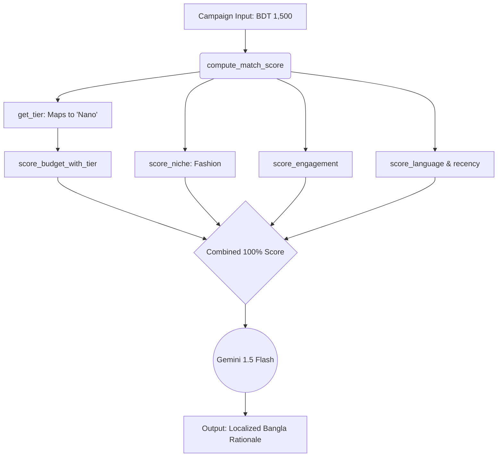

# BuildFest AI Depth Score — Cohesiq Submission

This document outlines the AI capabilities, architecture, and business context implemented in the Cohesiq platform for the BuildFest 2026 challenge. All claims reflect the actual codebase at the time of submission.

---

## 🌍 Public Summary

**Cohesiq** is a modern B2B SaaS Influencer Matching Platform designed to bridge the gap between brands and creators in the South Asian (specifically Bangladesh) influencer advertising ecosystem. The platform moves beyond simple vanity metrics—like raw follower counts—to focus on deep creator compatibility, verified audience tiers, and hyper-local campaign relevance.

Unlike first-generation platforms that prioritize expensive mega-celebrities and flat-fee brand awareness, Cohesiq leverages a robust deterministic heuristic scoring engine and semantic AI profiling to empower the "long-tail" economy. It allows local brands and small-to-micro businesses to instantly discover, vet, and partner with authentic content creators who perfectly align with their specific product niches and strict BDT budget constraints.

## 🎯 The Problem Statement

Despite Bangladesh’s rapidly growing $45M digital marketing ecosystem, the actual process of launching an influencer campaign is broken, particularly for micro and small businesses (SMBs). The market suffers from severe structural inefficiencies:

1. **The Manual Discovery Nightmare:** Finding creators matching a specific product niche (e.g., local artisanal fashion, hyper-local food delivery) is entirely informal. Brands are forced into time-consuming, manual hunting through Instagram DMs, Facebook groups, and WhatsApp chats, with no verifiable performance metrics.
2. **The Untracked Long-Tail:** Because first-generation incumbent platforms target enterprise clients and require massive budgets, a vast network of highly engaging micro-creators and small local businesses remains completely untracked and disconnected from the structured digital economy.
3. **Mismatched Economics & Unpredictable ROI:** Without data-driven matchmaking, low-budget campaigns are routinely mismatched with over-priced influencers or bot-inflated accounts, resulting in wasted sponsorships, low conversion rates, and severe operational friction that prevents SMBs from scaling.

---

## 🌐 Data & AI Provenance

**Data Sources:**
- **Web Scraped Data via Tavily API:** Used to search for and extract real-world information about Bangladeshi influencers across different platforms to seed realistic profiles.
- **LLM-Generated Synthetic Data:** Used to flesh out missing profile gaps, simulate diverse creator demographics, and generate varied rate cards, portfolios, and engagement metrics to ensure a robust testing environment.
- **Relational Seed Data:** 14 standardized niche categories (Technology, Gaming, Fashion, Beauty, Food, Travel, etc.) mapped to 4 follower size tiers (Nano, Micro, Macro, Mega).

**AI Models Used:**
- **Gemini 1.5 Flash:** Used for fast, cheap generation of localized match rationales and generating text embeddings for semantic similarity fallback.
- **Llama 3.1 8B (via Groq):** Used for high-speed synthetic data generation (creator demographics, rate cards) during the database seeding phase.
- **Claude:** Used extensively as our development-time pair-programming agent (via Cursor/Antigravity) for full-stack code execution and architectural planning.

**Responsible AI:**
1. **Data Provenance & Seeding:** For development and testing, we relied on Tavily-assisted web search combined with LLM synthetic data generation to simulate diverse demographics without mass-scraping private databases.
2. **Boundary Schema Security:** Every external data point passes through strict Pydantic v2 schemas at the API boundary, rejecting out-of-bounds metrics (e.g., negative follower counts).
3. **Explainable AI (XAI):** Cohesiq splits matching into six distinct, visible parameter weights (Niche, Budget, Platform, Engagement, Language, Recency) alongside clearly labeled, transparently marked "AI-Generated" explanation tags.

---

## 🛠️ Tooling & IDE

**IDE / Editor:**
- Antigravity / Cursor

**Deployment Method:**
- Docker & Docker Compose (orchestrating the multi-container stack locally, including frontend, FastAPI backend, and PostgreSQL 16 database).

**Frameworks & Libraries:**
- Next.js 15 (App Router), React, Tailwind CSS v4, shadcn/ui.
- FastAPI (Async), SQLAlchemy 2.0 (Async ORM), Alembic, Pydantic v2.
- Tavily, google-generativeai, groq.

**Context / Memory Files:**
- `AGENTS.md`
- `.agents/*`
- `graphify-out/graph.json`
- `graphify-out/GRAPH_REPORT.md`
- `docs/plan.md`
- `docs/schema.md`

---

## 📝 Prompt Usage

**How did you design prompts?**
We used structured JSON mode prompts tightly coupled with Pydantic validation schemas to enforce strict data extraction (e.g., Niche Classification). For rationale generation, we utilized role prompting with dynamic localization variables, allowing the AI to generate explainable match rationales in either English or Bengali based on brand UI preferences.

---

## 📉 Token Optimization Tools & Methods

**Selected strategies:**
- Structured outputs / JSON mode
- Cheap-model routing
- Graphify — graph-based prompt compression

---

## 🔍 Retrieval & RAG

**RAG Architecture Details:**
- **Naive RAG (chunk + embed + retrieve):** We implemented a semantic similarity fallback system within our PostgreSQL database. When exact relational heuristic matching fails, we utilize Gemini embeddings to match the semantic intent of the brand's campaign description against the indexed descriptions of creator portfolios.

---

## 🔌 MCP (Model Context Protocol) Usage

**MCP Servers:**
- **`graphify`**: Scans the codebase to build a navigable knowledge graph of our architecture and dependencies, tracing relations between campaigns and creator modules.
- **`context7`**: Retrieves up-to-date documentation and code examples for our frameworks (Next.js, FastAPI, Clerk) directly into the IDE.

**Tools Exposed:**
- **Graphify:** `mcp_graphify_graph_stats`, `mcp_graphify_god_nodes`, `mcp_graphify_query_graph`, `mcp_graphify_get_node`, `mcp_graphify_shortest_path`, `mcp_graphify_get_neighbors`, `mcp_graphify_get_community`.
- **Context7:** `mcp_context7_resolve-library-id`, `mcp_context7_query-docs`.

**Permissions:**
- Workspace read permissions (Graphify) and external API access (Context7) to augment the AI agent's knowledge base.

---

## 🛡️ Guardrails, Safety & Privacy

**PII redaction, content moderation, validation:**
Input bounds checking and strict output schema validation using **Pydantic v2**. We shifted from pure LLM decision-making to a deterministic Heuristic Engine because early LLM tests hallucinated budget tiers. The AI is now guarded by hard mathematical constraints (e.g., forcing BDT 1,500 budgets away from Mega-influencers) before it is allowed to generate the rationale text.

---

## 🎨 Frontend AI / Visual App Builders

**Tools Used:**
- v0 (Vercel)
- Cursor Composer / Agent

**Usage Details:**
We utilized **v0 by Vercel** to bootstrap the initial React component layouts and shadcn/ui dashboards (`/frontend/cohesiq-v0/`). **Cursor Agent** was then used to wire these static components to our FastAPI backend, handling complex state mapping and resolving Next.js App Router hydration issues.

---

## 🔄 AI Development Lifecycle (AI-DLC)

**Frameworks Adopted:**
- Cursor Rules + PRD workflow
- AGENTS.md spec

**Process Notes:**
We maintained strict system boundaries using an `AGENTS.md` spec file that dictated our FastAPI Domain-Driven Design (auth, creators, brands, campaigns). The AI agent was strictly gated from making cross-domain router imports, forcing all complex AI logic into isolated service layers, ensuring the architecture remained modular.

---

## 🎥 YouTube Video Guidance: "Vibe to Production in 180 Seconds"

*(The following is a 180-second speech deck tailored to the BuildFest Pitch Standard, matching the strict flow requirements and utilizing our architectural graph.)*

### ⏱️ 0:00–0:30 | Problem (The Vibe)
*(Visual: Screen showing chaotic Instagram DMs, spreadsheets, and fake bot followers, cutting to the clean Cohesiq login page)*

**Speaker:** "Bangladesh’s influencer market is exploding toward a 45 million dollar valuation. But for small and micro-businesses, running a campaign is a nightmare. They are forced to manually hunt for creators through WhatsApp and DMs, guessing at vanity metrics where nearly 50% of accounts are polluted by bots. This means wasted budgets, mismatched audiences, and zero predictable ROI. There has to be a better way to connect authentic local brands with the untracked long-tail of micro-creators."

### ⏱️ 0:30–1:00 | Solution
*(Visual: Fast, smooth transition into the Cohesiq B2B Dashboard. Showing the 'Create Campaign' screen with BDT budget sliders.)*

**Speaker:** "Enter Cohesiq—a modern B2B SaaS Influencer Matching Platform designed specifically for the South Asian ecosystem. We move past raw follower counts. Cohesiq empowers local brands to instantly discover and vet creators based on deep compatibility, verified audience tiers, and strict BDT budget constraints. We replace the manual spreadsheet with a transparent, localized, and deterministic AI matching engine."

### ⏱️ 1:00–2:00 | Demo / Concept Flow
*(Visual: Live screen-recording. User clicks "Run Matching" on a campaign. The screen populates with ranked Creator Cards showing "Match Score" and localized reasoning.)*

**Speaker:** "Let’s see it in action. A local artisanal fashion brand creates a campaign with a micro-budget of just 1,500 BDT per creator. When they hit 'Run Matching', Cohesiq instantly traverses our database of creators. 

Within milliseconds, it filters out expensive mega-celebrities and identifies the perfect 'Nano' creators. Look at the results—not only do we get a precise Match Score, but our system automatically generates a transparent, human-readable rationale explaining exactly *why* this creator is a fit. And because we are building for the local market, the UI and AI rationales can dynamically toggle to Bangla to support native brand managers."

### ⏱️ 2:00–2:30 | AI Approach
*(Visual: Switch to the Architecture Diagram below showing the flow from campaign input, through the heuristic node flow, ending at Gemini Flash.)*

**Speaker:** "Here is the real AI thinking behind the scenes. We initially built a pure LLM matching pipeline (`llm_matching.py`). But in testing, LLMs hallucinated budget constraints. So, we pivoted to a hybrid architecture. 

As you can see on this graph flow, the core engine (`compute_match_score`) routes through six deterministic nodes: it calls `get_tier()` to map follower counts to Nano or Micro tiers, then pushes data through `score_budget_with_tier`, `score_niche`, and `score_engagement`. We ensure mathematical accuracy first. Then, we pass those verified metrics to **Gemini 1.5 Flash**—acting as our semantic RAG layer—to generate the localized Bangla reasoning tags. It’s deterministic math guarded by semantic AI."

### ⏱️ 2:30–3:00 | Impact & Next Step
*(Visual: Show the creator pipeline, maybe a KOS tracking dashboard mockup, zooming out to a map of South Asia.)*

**Speaker:** "The impact is immediate: zero wasted ad spend, zero manual hunting, and total pricing transparency for unbanked creators. We’ve solved the marketplace cold-start problem using public YouTube Data syncing and strict Pydantic schema validation. 

Next up? We are implementing automated escrow payouts via bKash and expanding this Key Opinion Seller tracking model across South Asia. We are Cohesiq—and we've taken creator matchmaking from chaotic vibes to structured production."
