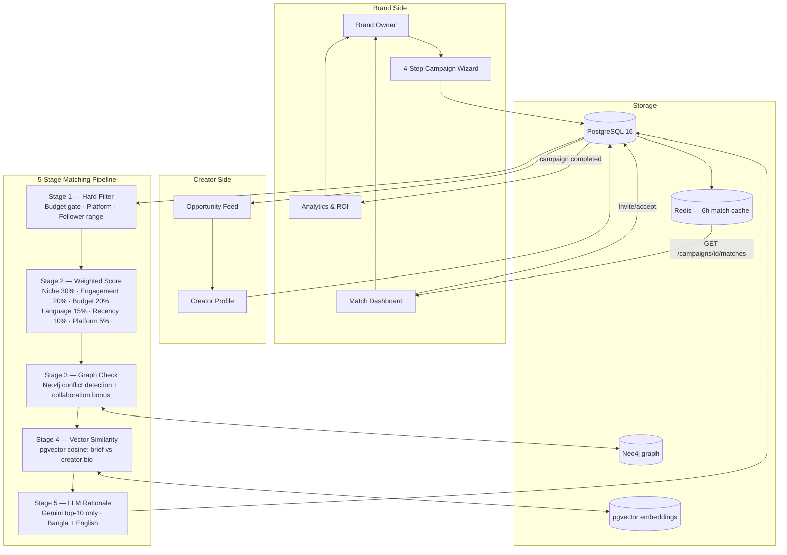

# Tasks — Sakib (Brand & Creator Marketplace · Campaign Workflow · UI)

Derived from `docs/plan.md` (the unified plan). Source of truth chain:
`requirements.md` → `srs.md` → `plan.md` → this file.

**Ownership:** the brand/creator marketplace UI and campaign workflow. Navid owns YouTube
ingestion, the matching engine internals, semantic/LLM services, and seeding (`tasks-navid.md`).

> **Workstream phases ≠ plan phases.** The `A/B/C/D` headings below are *Sakib's local
> workstream* and predate the unified plan. They map onto `docs/plan.md` phases as:
>
> | This file | Plan phase | Theme |
> |---|---|---|
> | Workstream A (A01–A11) | Plan Phase B | Campaign type + creation wizard |
> | Workstream B (B01–B06) | Plan Phase B | Campaign management Kanban |
> | Workstream C (C01–C03) | Plan Phase C/D | Analytics & ROI |
> | Workstream D (D01–D05) | Plan Phase D | Quality-of-life / AI features |
>
> The two type taxonomies (`campaign_type` vs `collaboration_type`) are intentionally
> distinct — see `docs/plan.md` §3.1. Do not merge them.

## Legend

- `[x]` Done & verified
- `[~]` Partially done / needs verification or testing
- `[ ]` Not started
- `[!]` Broken / needs fix
- `[P]` Can run in parallel with other tasks in the same phase

---

## Deliverables Status

| Artifact | Status | Location |
|---|---|---|
| System data flow diagram | `[x]` | Section 5 below |
| Brand pain points analysis | `[x]` | Section 6 below |
| Matching engine parameters | `[x]` | Section 7 below |
| `campaign_type` PostgreSQL enum | `[x]` | migration `0013_campaign_type_kpis.py` |
| `kpi_targets`, `hashtags`, `tracking_notes` columns | `[x]` | same migration |
| Updated SQLAlchemy model | `[x]` | `backend/app/campaigns/models.py` |
| Updated Pydantic schemas | `[x]` | `backend/app/campaigns/schemas.py` |
| `CampaignType` TS type + `KpiTargets` interface | `[x]` | `lib/types.ts` |
| `CampaignTypeBadge` component | `[x]` | `campaigns/_components/CampaignTypeBadge.tsx` |
| Type column in campaign list | `[x]` | `campaigns/page.tsx` |
| 4-step campaign creation wizard | `[~]` | `campaigns/new/page.tsx` — built, bug fixed, needs E2E test |
| `mapCampaignResponse` explicit field mapping | `[x]` | `lib/api/campaigns.ts` |
| Application review drawer (B02-B04) | `[x]` | `campaigns/[id]/_components/ApplicationDrawer.tsx` |
| Kanban w/ clickable cards | `[x]` | `CampaignDetailClient.tsx` |
| Active Contracts tab | `[x]` | `CampaignDetailClient.tsx` |
| `updateApplicationStatusAction` server action | `[x]` | `_actions/campaign-actions.ts` |
| ROI Summary stats card (C01) | `[x]` | `brand/dashboard/page.tsx` |
| Campaign Overview panel | `[x]` | `brand/dashboard/page.tsx` |

---

## Phase A — Campaign Type + Creation Wizard

**Goal:** Replace minimal single-page form with a 4-step wizard capturing all data needed for accurate matching.

[x] A01 Add `campaign_type` PostgreSQL enum (6 values: `paid_content`, `product_gifting`, `affiliate`, `brand_ambassador`, `talent_booking`, `ugc_only`)

[x] A02 Alembic migration `0013_campaign_type_kpis.py` — adds `campaign_type`, `kpi_targets JSONB`, `hashtags TEXT[]`, `tracking_notes TEXT`

[x] A03 Update `Campaign` SQLAlchemy model with new columns

[x] A04 Update `CampaignCreate`, `CampaignUpdate`, `CampaignOut` with new fields + `KpiTargets` sub-schema

[x] A05 Add `CampaignType` and `KpiTargets` to `lib/types.ts`

[x] A06 Create `CampaignTypeBadge` component

[x] A07 Add Type column to campaign list page

[x] A08 Fix: `<SelectItem value="">` crash — Radix Select rejects empty string values; replaced with `"any"` sentinel and mapped back to `""` before submit

[~] A09 Wizard end-to-end verification — UI confirmed working through all 4 steps
  - [ ] Create campaign through all 4 steps → verify saves to DB with correct `campaign_type`
  - [ ] Verify `kpi_targets` JSONB stored correctly
  - [ ] Verify `hashtags[]` stored correctly
  - [ ] Verify deliverable rows saved to `campaign_deliverable_requirements`
  - [ ] Verify campaign appears in brand list with correct type badge

[x] A10 [P] Pass `campaign_type` through `mapCampaignResponse` in `lib/api/campaigns.ts` so it appears on the `Campaign` object from all API calls

[ ] A11 Update edit form (`campaigns/[id]/edit/page.tsx`) to include campaign type + new fields at parity with creation wizard

---

## Phase B — Campaign Management Kanban

**Goal:** Brand can manage all applications for a campaign from a single Kanban view instead of a flat table.

[x] B01 Kanban in `CampaignDetailClient.tsx`: columns = Invited | Needs Review | Shortlisted | Accepted — cards are clickable

[x] B02 Application review side-drawer (`ApplicationDrawer.tsx`): creator stats, social profiles, engagement rate, proposed rate, proposal text

[x] B03 Accept / Shortlist / Reject controls in drawer wired to `updateApplicationStatusAction` → backend PATCH

[x] B04 Rejection reason textarea shown when brand selects Reject (optional, sent to creator)

[x] B05 Active Contracts tab: lists accepted creators with agreed rate + content deadline

[ ] B06 [P] Wire reviews to real data — replace placeholders in `lib/api/reviews.ts` with `GET /creators/{id}/reviews` and `GET /brands/{id}/reviews`

---

## Phase C — Analytics & ROI

[x] C01 ROI Summary Card on brand homepage: Active Campaigns · Pending Applications · Budget Committed · Estimated Reach + Campaign Overview panel with budget by type

[ ] C02 Per-campaign analytics: engagement snapshots at Day 7 / 14 / 30 after publish — **depends on Navid N01/N02** (persisted YouTube data) for real numbers; until then, estimated/labelled

[ ] C03 Creator performance comparison across accepted creators per campaign

---

## Cross-team handoffs (Sakib ↔ Navid)

| Sakib task | Needs from Navid | Why |
|---|---|---|
| Render six match-score bars (`MatchesClient.tsx`) | N04 (persist platform/recency/semantic/rank) | FR-10 needs all six dimensions stored |
| D01 Authenticity Auditor (UI) | N06 (Trust Score backend) | UI renders the score Navid computes |
| C02 per-campaign analytics | N01/N02 (real YouTube data) | real reach/engagement vs estimated |
| B06 reviews wiring | backend `GET /creators/{id}/reviews` exists | confirm endpoint shape before wiring |

---

## Phase D — Quality-of-Life Features

[ ] D01 Authenticity Auditor (UI) — inline 0-100 trust score on creator cards. **Backend = Navid N06**; this task is the card UI + flag labels + explanation tooltip

[ ] D02 AI Brief Analyzer — brand pastes free text, Gemini pre-fills wizard fields (campaign type, niche, budget range, KPI targets). Maps to SRS FR-8 / US-14 (coordinate the Gemini call with Navid N05)

[ ] D03 Budget & ROI Calculator — pure frontend widget: budget input → creator tiers affordable + estimated reach + projected ROI (zero API calls)

[ ] D04 Rate Card Benchmark Widget — median rates by tier + niche (reads `creator_rate_cards`)

[ ] D05 Creator Comparison Tool — side-by-side 2-3 creators with Gemini recommendation for the brand's specific brief

---

## 5. System Data Flow Diagram



---

## 6. Brand Pain Points

| Pain Point | Cohesiq Solution |
|---|---|
| Fake followers / bot engagement | Authenticity Auditor: engagement Z-score + Gemini comment quality |
| Audience demographics mismatch | Campaign wizard demographic targeting + creator audience data fields |
| No pricing transparency | Rate Card Benchmark widget (median by tier + niche) |
| No ROI tracking | Affiliate UTM + promo codes + Day 7/14/30 engagement snapshots |
| Manual outreach across WhatsApp/email | Centralised application inbox + state machine + notifications |
| No contract or payment protection | Platform contracts + escrow hold + approve-before-payout |
| Hidden competitor conflicts | Neo4j COLLABORATED_WITH edge with 90-day recency check |
| Time-consuming creator vetting | AI-ranked matches with 6-bar score breakdown shown upfront |
| No single campaign dashboard | Kanban: Applied → Shortlisted → In Progress → Review → Completed |

---

## 7. Matching Engine Parameters (for teammate's reference)

### Hard Filters — Stage 1 (eliminates ~80% of pool before scoring)

| Filter | Logic |
|---|---|
| Platform | Creator must have profile on at least one required platform |
| Budget | `creator_rate ≤ campaign.budget_per_creator_max × 1.3` |
| Followers | Within `[creator_min_followers, creator_max_followers]` |
| Availability | `creator_profiles.is_available = true` |
| Authenticity | `authenticity_score > 40` |

### Weighted Score — Stage 2

```
total = niche×0.30 + engagement×0.20 + budget×0.20
      + language×0.15 + recency×0.10 + platform×0.05
```

| Score | Function |
|---|---|
| `score_niche` | 1.0 primary match, 0.6 sub-niche, 0.0 miss |
| `score_engagement` | `min(rate / tier_benchmark / 1.5, 1.0)` |
| `score_budget` | 1.0 (≤budget), 0.5 (≤budget×1.3), 0.0 (over) |
| `score_language` | fraction of required languages covered |
| `score_recency` | 1.0 (≤7d), 0.7 (≤30d), 0.3 (≤90d), 0.0 (>90d) |
| `score_platform` | required platforms covered / total required |

### Graph Adjustments — Stage 3

- Competitor conflict (last 90 days): `score × 0.5`
- Past successful collaboration: `score + 0.05`

### Semantic Bonus — Stage 4

- `final = total + (cosine_similarity × 0.10)` applied to top-20 candidates only

### LLM Rationale — Stage 5

- Gemini on top-10 results only. Stored in `ai_match_scores.rationale`.
- Cites: niche match reason, engagement signal, budget fit, one differentiating factor.
- Never runs on full pool — prevents hallucination from large context.

---

## 8. Campaign Types Reference

| Enum Value | Label | Fee |
|---|---|---|
| `paid_content` | Paid Sponsored Content | 10% of campaign value |
| `product_gifting` | Product Gifting | Subscription-gated (Growth plan+) |
| `affiliate` | Affiliate Marketing | 5% of commissions earned |
| `brand_ambassador` | Brand Ambassador | 5% monthly retainer |
| `talent_booking` | Talent Booking | 10% of talent fee |
| `ugc_only` | UGC Content Only | 10% of content fee |
